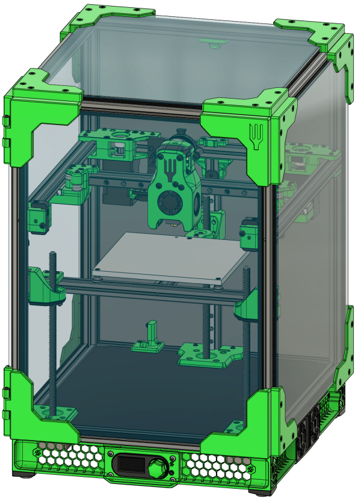

# Introduction

    

Welcome to the Salad Fork manual! This will give you the info you need in order to complete the physical assembly of the printer. If you run into any difficulties or issues with the manual, please jump over to the discord channel and let us know!
# General notes
* If your kit includes machined nut rails those are preferable to the printed parts and should be used instead

## Conventions used in this document
* BHCS - Button head cap screw
* SHCS - Socket head cap screw

# Table of Contents
- [Print considerations](what_to_print.md)
- [Frame assembly](frame_assembly.md)
- [Z motion](z_motion.md)
- [XY motion](xy_motion.md)
- [Gantry](gantry.md)
- [Bed](bed.md)
- [Belts](belts.md)
- [Klicky](klicky.md)
- [Mini-Afterburner](mini-ab.md)
- [Electronics](electronics.md)
- [Skirts](skirts.md)
- [Wiring](wiring.md)
- [Panels](panels.md)