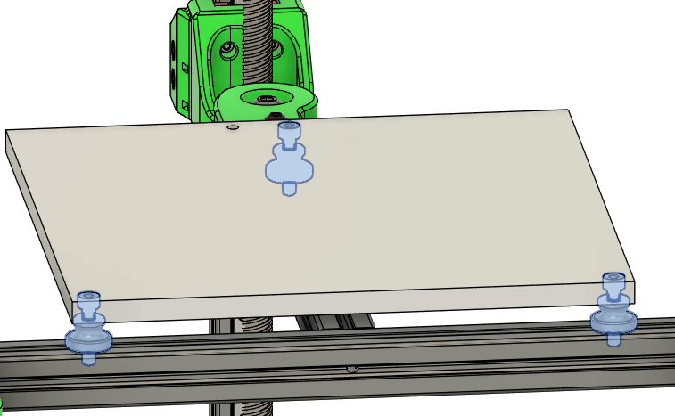

# Prepare the bed

**Parts needed:**
* MIC6 aluminum bed
* Bed heater
* RTV silicon (600*F rated)

**Steps:**
1. Attach the bed heater to the bottom of the bed. The bottom is the side without the countersink holes for the mounting screws. 
2. Use RTV silicon around the edges of the bed heeater as an extra precaution for safety. Refer to [Nero 3D - Cast Aluminum Printer Bed - Putting together the best DIY print platform for your 3d printer](https://www.youtube.com/watch?v=vZx4vfevwx4) for a great video outlining the process

# Attach the bed

**Parts needed:**
* Bed
* 3 M4 knurled Nut
* 3 M3x16 SHCS 

**Steps:**
1. Use the M3x16 SHCS to attach the bed to the frame, using the M4 knurled nuts as a spacer between the bottom of the bed and the extrusions 

