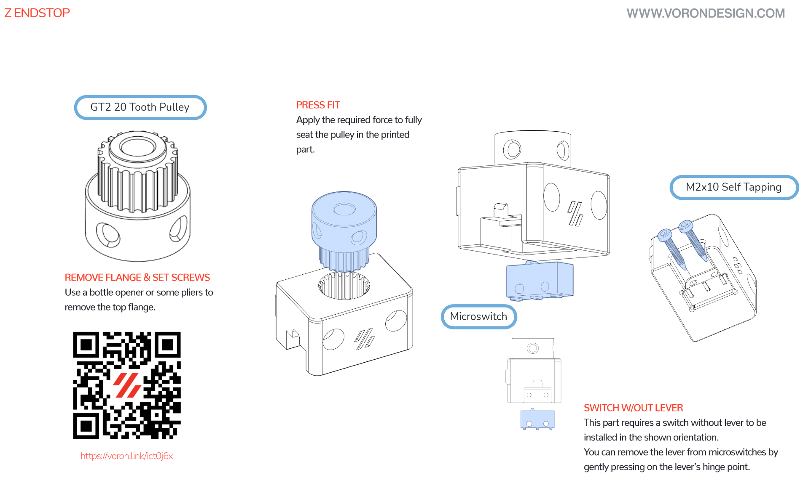
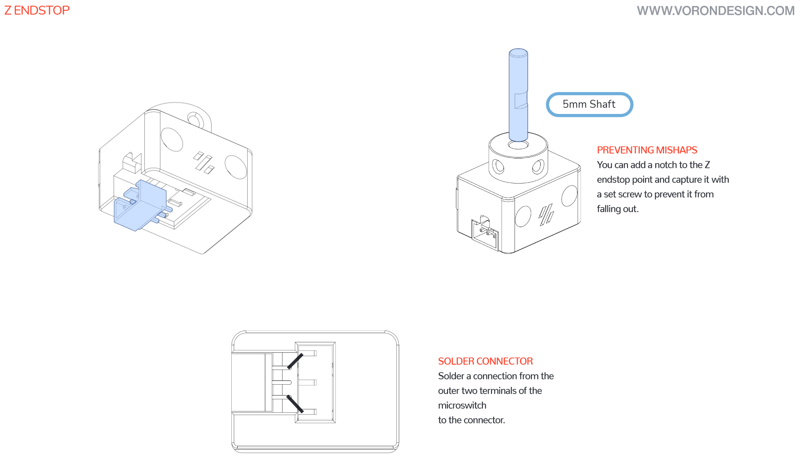
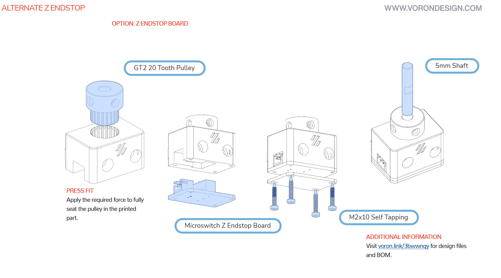
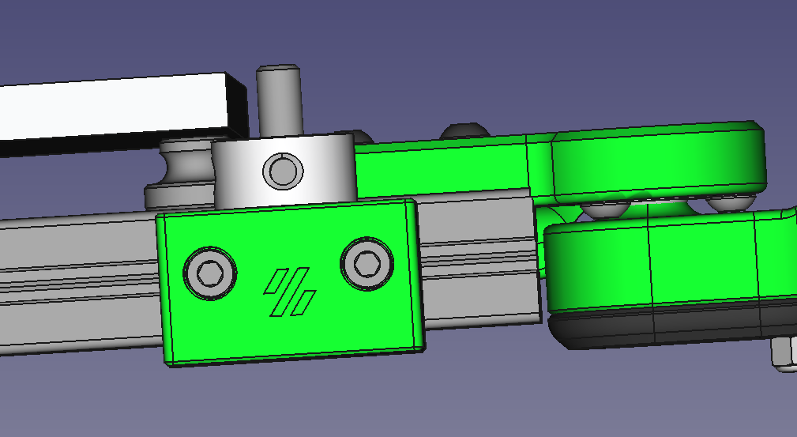
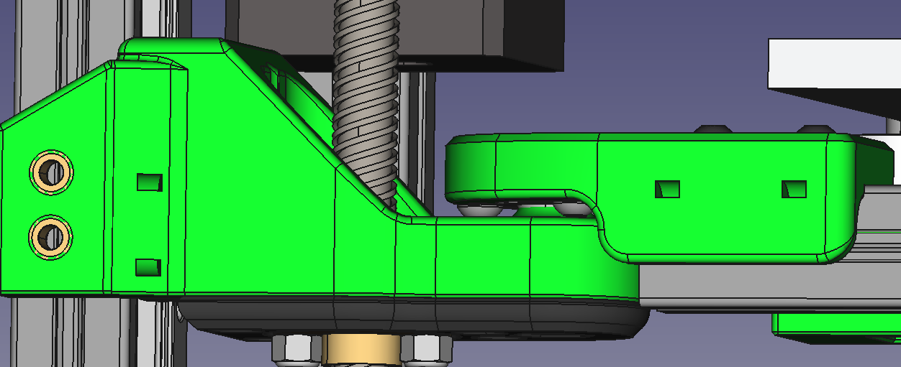
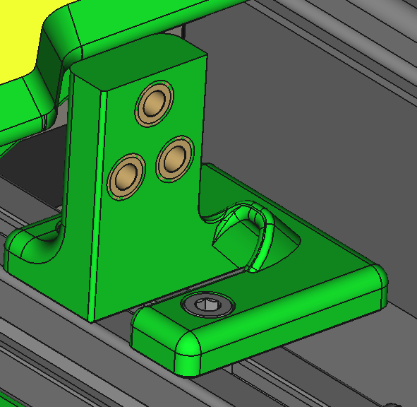

# Prepare the bed

**Parts needed:**
* MIC6 aluminum bed
* Bed heater
* RTV silicon (600*F rated)

**Steps:**
1. Attach the bed heater to the bottom of the bed. The bottom is the side without the countersink holes for the mounting screws. 
2. Use RTV silicon around the edges of the bed heater as an extra precaution for safety. Refer to [Nero 3D - Cast Aluminum Printer Bed - Putting together the best DIY print platform for your 3d printer](https://www.youtube.com/watch?v=vZx4vfevwx4) for a great video outlining the process

# Attach the bed

**Parts needed:**
* Bed
* 3 M4 knurled nut
* 3 M3x16 SHCS
* 6 M3 washers (optional if the countersunk holes are deeper, they would fit between the bed and the knurled nut)

**Steps:**
1. Use the M3x16 SHCS to attach the bed to the frame, using the M4 knurled nut (and optionally washers) as a spacer between the bottom of the bed and the extrusions 

# Attach the Z Endstop

**Parts needed:**
* 2 M3x20 SHCS
* 1 GT20 pulley
* 1 5mmx20 shaft
* 4 M2 self tapping screws

**Printed parts needed:**
* 1 z_endstop_x1.stl

**Steps:**

The process is identical to the steps on the Voron 2.4, and the 3 images below are taken directly from their excellent manual.

Attach the endstop to the rear of the bed on the righthand side, using 2 M3x20 SHCS. Route the wires under the bed and bundle them with the heatbed wiring.

# Route the wiring and attach the cable chain

**Parts needed:**
* 3 zipties
* 2 cable chain ends
* 13 cable chain links (approximately)
* 4 M3x6 BHCS (or 6 M3x6 BHCS if using igus chains)

**Steps:**

Route the wires to the back of the printer, and use the 3 ziptie mounts to secure them.

Connect the cable chain end using 2 (or 3) M3x6 BHCS, with the chain entrance facing upward.

Route the wires through the cable chain, and connect it at the top

Connect the cable chain end at the base of the printer using 2 (or 3) M3x6 BHCS, and run the wires through the hole in the chain mount base.

Note that if you are using the two hole chain ends, the mount will be reversed. The instructions remain the same otherwise.
