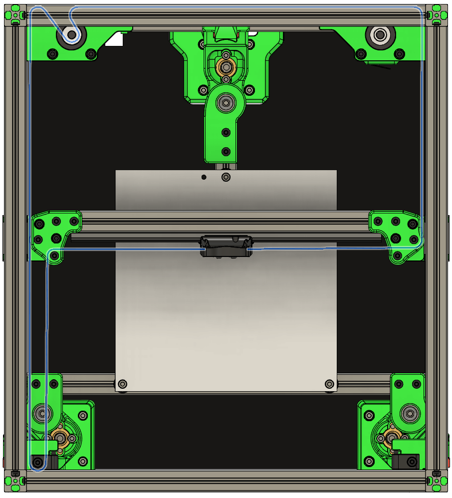
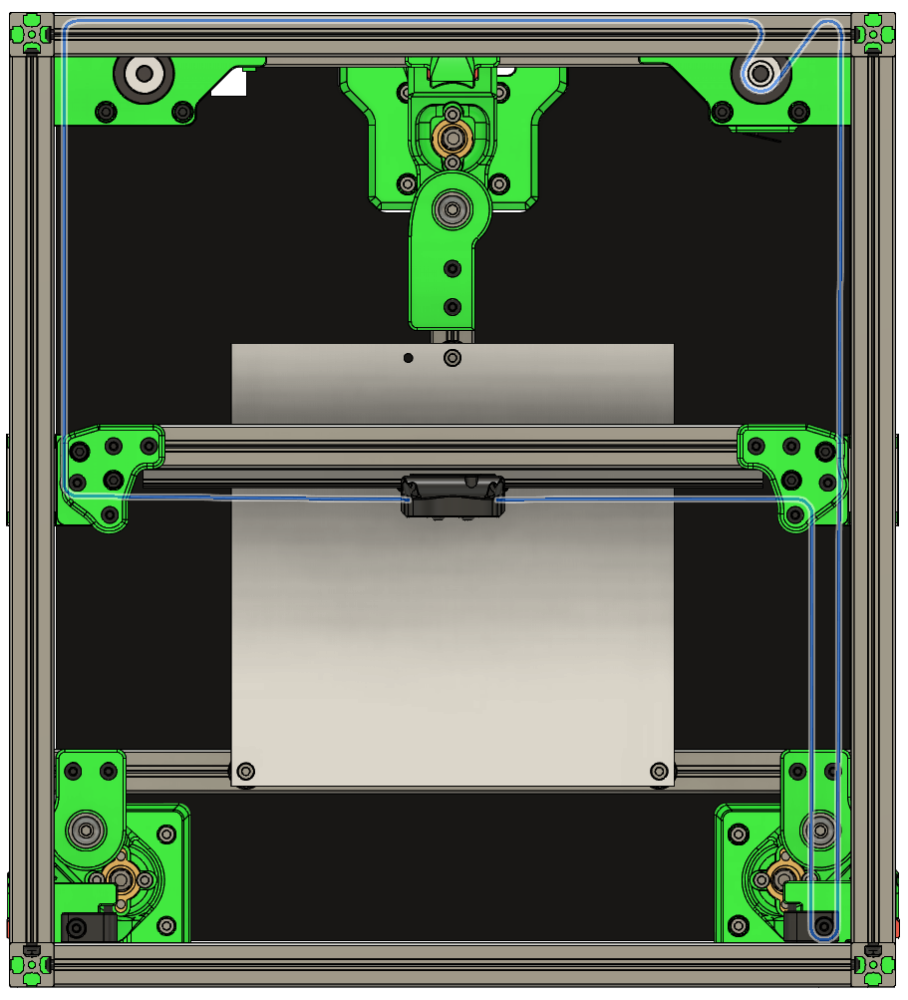
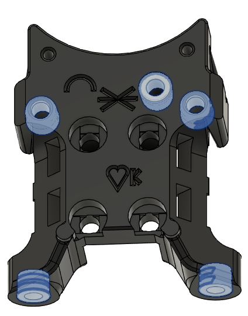

# Adding the belts to the printer

# Add the B belt

**Parts needed:**
* GT2 belt

**Steps:**
1. Route the belt as shown in this image. The exact length is not critical at this step, but make sure there is at least a few cm extra in the middle where the belts will attach to the carriage later. It may also be helpful to temporarily remove the adjustment screws from the front idlers

2. Remove the belt, and use it to cut an exactly equal length of belt. It's helpful to align the teeth of the belt to mak sure the lengths are even. It's _very important_ that the lengths of the two belts are **exactly equal**, with the same number of teeth on each
3. Re-add the belt, using the same routing as before

* Note *
When working around the front idlers and the rear motors, it may help to have a curved pick to help route the belts.  Look for 'pick kit' on your favorite shopping site.

# Add the A belt

**Parts needed:**
* GT2 belt cut in previous step

**Steps:**
1. Now add the second belt, this one goes to the A motor, as shown here

# Add the carriage and anchor the Belts

**Parts needed:**
* 5 M3 heatsets (or 4 for stealthburner)
* 4 M3x8 BHCS

**Printed parts needed:**
* 1 x_carriage_upper

*note*
If you are using the stealthburner, your carriage will look slightly different, and use 1 less heat insert.

**Steps:**
1. Add 5 (or 4) M3 heatsets into the x_carriage_upper 

2. Thread the belt ends through the cutouts in the x carriage. Try to get the lengths roughly equal at this point
3. Using M3x8 BHCS, lightly attach the carriage to the MGN9C rail carriage, but do not tighten yet
4. Pull the belts as needed to get an *exactly equal* length on the top belt and bottom belt on each side. It's not critical if the excess belt on the left is equal to the excess belt on the right, but they should be close. However it is critical that the excess on the top belt matches the excess on the bottom belt
5. Tighten the M3x8 BCHS to lock the carriage and belts in place
6. It's ok to trim excess belt now, but still leave at least 1cm available on each side

# Belt alignment

Check the belts and verify that they are perfectly aligned within the pulleys and bearings, and that the belts do not ride over the flanges. Move the gantry around in X and Y and verify that the everything moves smoothly with no binding and the belts remain centered. 

When complete, remove the grub screws from the motor pulleys, apply loctite (removable variant, blue) to them and re-insert. Do this one screw at a time to ensure the alignment remains correct.

# Belt tension and gantry racking

Belt tension and gantry racking are two important steps which are very well covered by community documentation. Go to [Belt tension](https://docs.vorondesign.com/tuning/secondary_printer_tuning.html#belt-tension) for more detailed information and instructions. 
