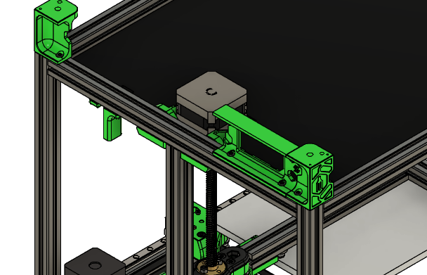
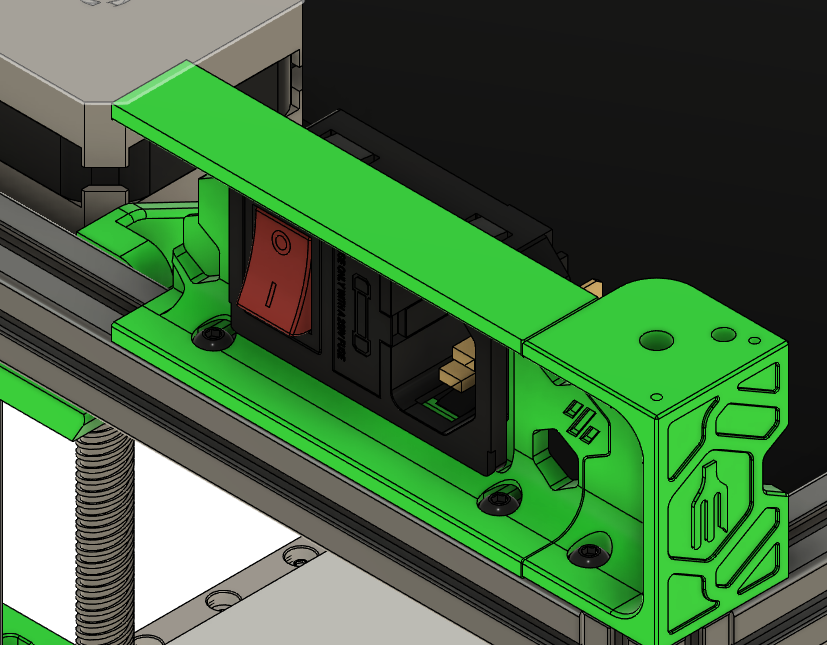

# Mains inlet

**Parts needed:**
* 1 AC inlet
* 2 M3x6 BHCS

**Printed parts:**
* 1 skirt_rear_ac_inlet

**Steps:**
1. Attach the skirt_rear_ac_inlet using the M3x6 BHCS to the right rear corner of the printer on extrusion G 
2. Insert the AC inlet into the skirt, it should click into place securely 

# Power rail
** THIS IS FOR 160 BUILD **

**Parts needed:**
* 1 DIN rail 
* 4 M3x10 BHCS
* 4 M3x6 BHCS
* 4 M3 heatsets 
  

**Printed parts:**
* 2 din_mount
* 2 uhp-350_din_rail_bracket

**Steps:**

Tomorrow

# Control rail
** THIS IS FOR 160 BUILD **

