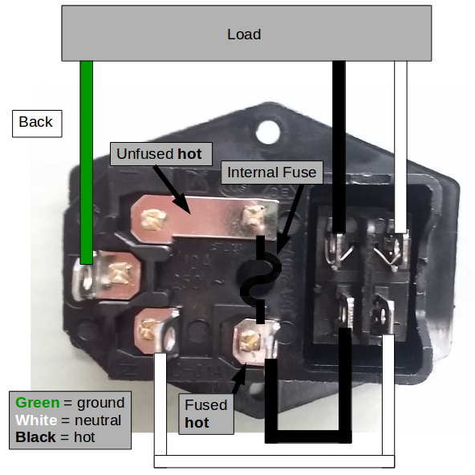
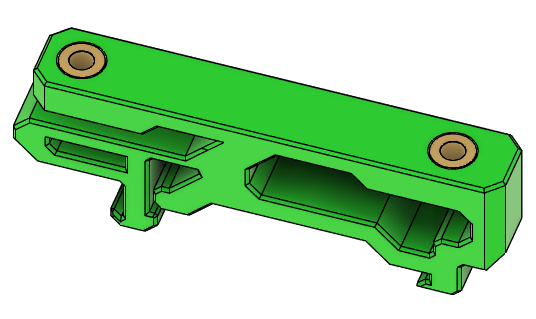
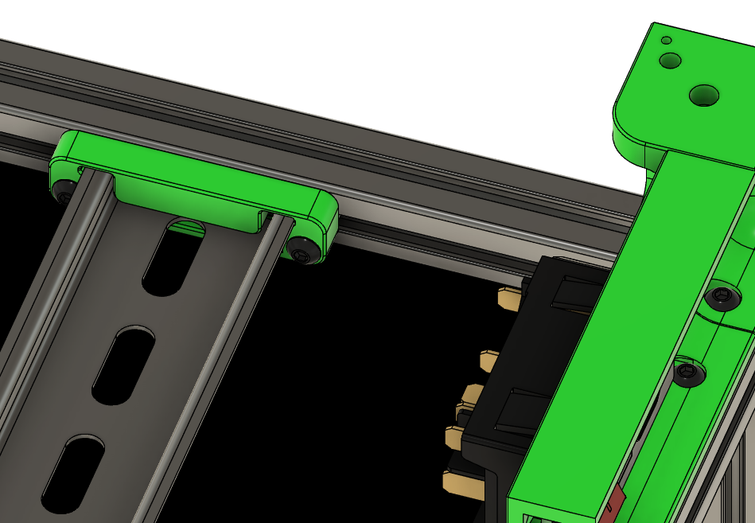
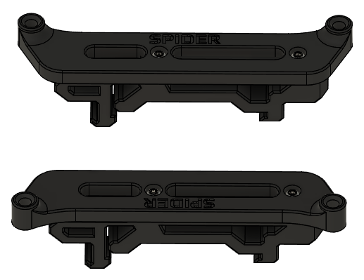
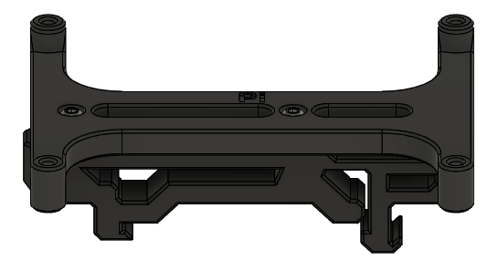
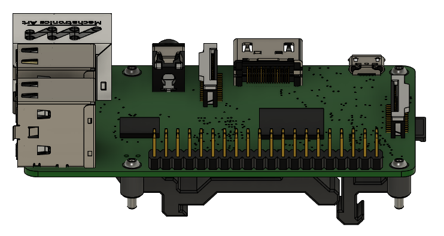
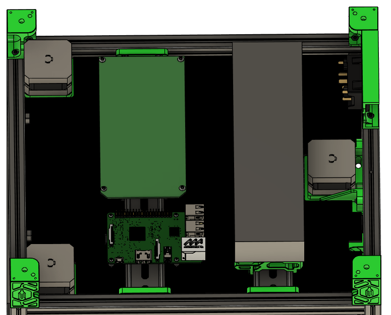

# Mains inlet

**Parts needed:**
* 1 AC inlet
* 2 M3x6 BHCS
* 3 colors of ~12-14 guage wire (recommended green, white, black)
* ~7 male spade connectors (or solder and heatshrink tubing)

**Printed parts:**
* 1 skirt_rear_ac_inlet

**Steps:**
1. Attach the skirt_rear_ac_inlet using the M3x6 BHCS to the right rear corner of the printer on extrusion G

2. Wire up the power connector as shown. Please be careful, and ensure the connections are solid, and properly sheathed to avoid accidental contact.

When connecting the wires, the switch connectors with the narrower spacing receive the power, and the wider set should get the outputs to the PSU.  Failure to note this will result in the switch LED (if present) remaining on all the time. 

3. Insert the AC inlet into the skirt, it should click into place securely

# Power rail

**Parts needed:**
* 1 DIN rail 
* 4 M3x10 BHCS
* 4 M3x6 BHCS
* 4 M3 heatsets 
  

**Printed parts:**
* 2 din_mount
* 2 uhp-350_din_rail_bracket

**Steps:**
1. Insert 2 heatsets into each uhp-350_din_rail_bracket

2. Use the M3x6 BHCS to attach the din rail brackets to the power supply
3. Slide the din_mount parts onto the din rail
4. Use the M3x10 BHCS to attach the din_mount to the frame on the bottom H extrusions towards the rear of the printer

5. Clip the power supply on to the din rail, orient it so that the AC side of the power supply is close to the inlet to reduce wiring length

**Note:**
You may need/want to reverse the power supply and mcu locations, depending on the length of your cables.  Check lengths before committing.

**Note:**
To keep the CAD simple, a dimensionally-accurate cube was substituted for the power supply in the images. 

# Control rail

**Parts needed:**
* 1 DIN rail 
* 4 M3x10 BHCS
* 14 M2x10 self tapping
* 4 M3x6 BHCS
  

**Printed parts:**
* 3 din_clip_for_pi_and_mcu
* 1 din_rpi_bracket
* 1 din_octopus_bracket or din_spider_bracket (use the correct one for your MCU)

**Steps:**
1. Attach the MCU brackets to the din_clip_for_pi_and_mcu using M2x10 self-tapping screws. This image shows a Spider MCU, but it is the same process for the Octopus.

2. Use M3x6 BHCS to attach the MCU to the brackets
3. Use M2x10 self-tapping screws to assemble the din_rpi_bracket and the din_clip_for_pi_and_mcu

4. Use M2x10 self-tapping screws to mount the RPi to the printed brackets

5. Slide the din_mount parts onto the din rail
6. Use the M3x10 BHCS to attach the din_mount to the frame on the bottom H extrusions towards the front of the printer
7. Clip the RPi and MCU to the rail

