# Lay out the frame and label the extrusions

Lay out your extrusions like this and add a label to each. We'll be referring to these by their label througout the build process.

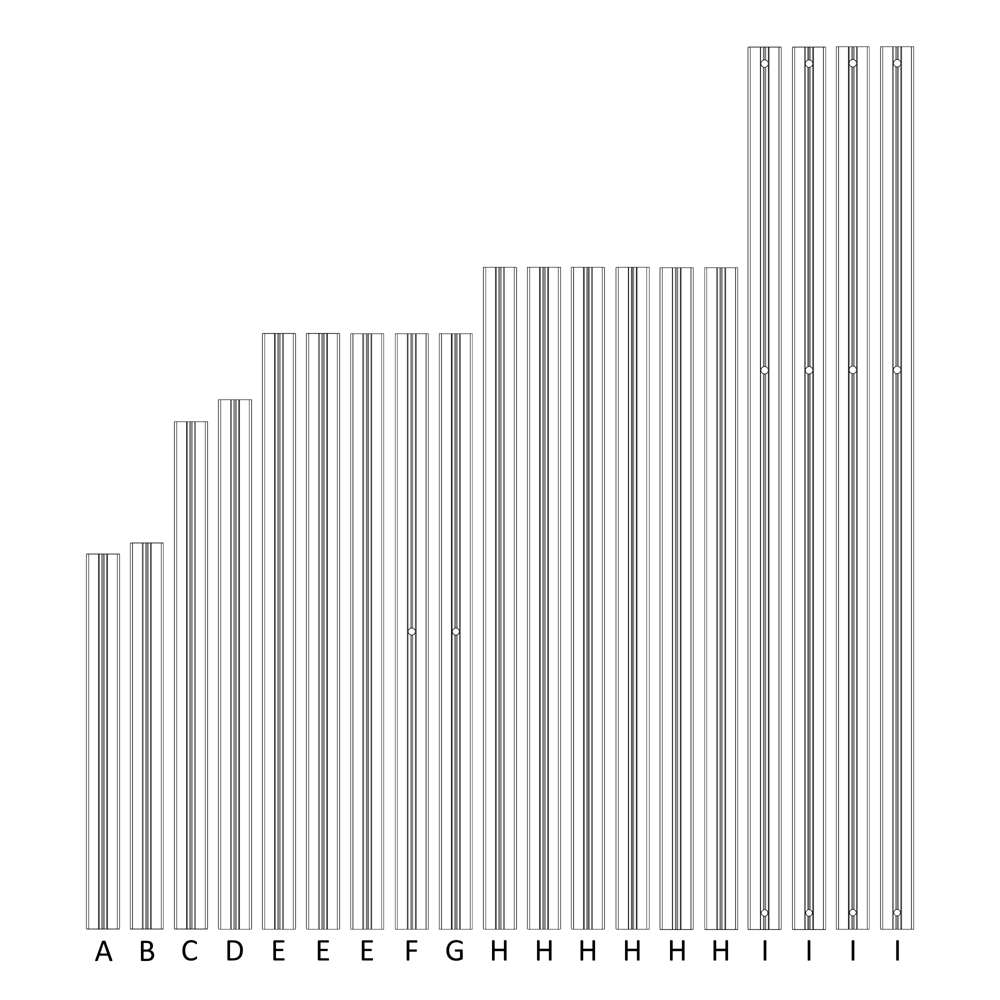

To help visualize where these go in the printer, you can refer to this image to see where they go

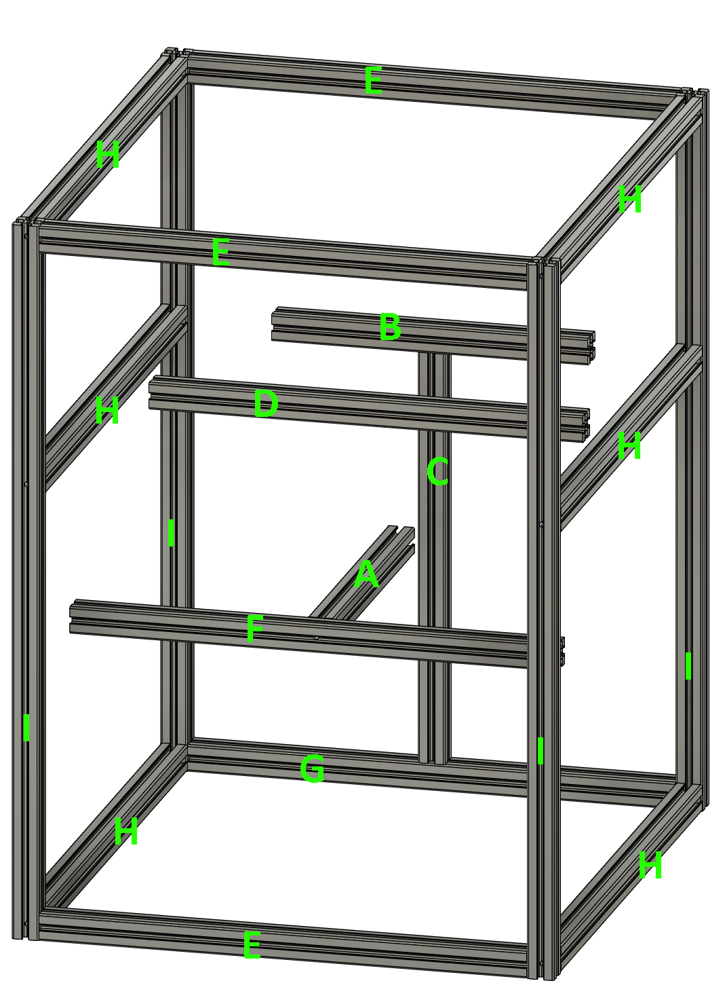

# Prep the rails 

In this step, you will prepare the linear rails for use. Some vendors are providing rails which do _not_ need to be prepared prior to use, if you have one of these then skip this step.

**Parts needed:**
* All 5 linear rails

**Steps:**
1. Clean out any shipping grease with Isopropyl alchohol and any other gentle degreaser.
2. Using a NGLI2 rated grease such as Mobilux EP2, pack the rail bearings with grease and ensure that the rails move smoothly. Refer to [Nero3d - Lubrication Basics](https://www.youtube.com/watch?v=UYvhYjkBFTY&list=PL7zrGeKp_8CTDOmpwZr5JnCSJqEghFh9j&index=38) for a more in-depth explanation.

# Add the front Z rails

**Parts needed:**
* 2 extrusions with the label I
* 2 Z rails (MGN7H-200)
* 14 M2 nuts
* 14 M2x6 BHCS
* 2 M3x8 BHCS
* 2 M3 nut
  
**Printed parts:**
* 2 Rail stops ([a]_railstop)
* 2 Z rail nut holders (z_rail_nut_holder)
* 2 MGN7 rail guides (MGN7_Rail_Guide)

**Note**
Some extrusions may not properly fit the z_rail_nut_holder part.  The 
part is 3mm tall, and some extrusion channels are only 2.5mm tall.  Taking
into account the size of the m2 nuts, you should resize the rail holder parts
in the Z axis only to 2.0mm.

**Steps:**

1. Put 7 M2 nuts in each z rail nut holder, skipping every other hole
2. Insert rail nut holder into extrusion
3. Attach MGN7H rail with M2 BHCS
4. Use the MGN7 rail guide parts to center the rail on the extrusion
5. Align bottom of rail 22mm from end before tightening screws. 
6. Using a M3x8 BHCS and M3 nut, attach the railstop to the top of the rail
7. Repeat for second extrusion
8. **Be careful to not let the rail carriage slide off the rail**

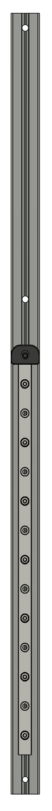
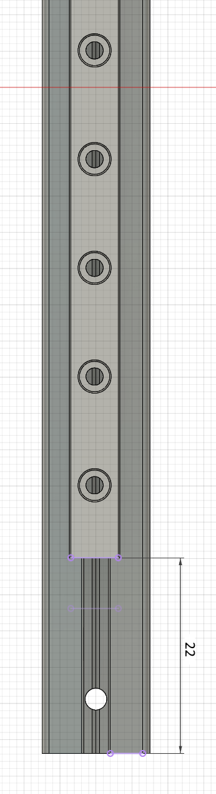

# Add rear Z rail

**Parts needed:**
* 1 extrusion with the label C
* 1 Z rail (MGN7H-200)
* 7 M2 nuts
* 7 M2x6 BHCS
* 1 M3x8 BHCS
* 1 M3 nut
  
**Printed parts:**
* 1 Rail stops ([a]_railstop)
* 1 Z rail nut holders (z_rail_nut_holder)
* 2 MGN7 rail guides (MGN7_Rail_Guide)

**Note**
Some extrusions may not properly fit the z_rail_nut_holder part.  The 
part is 3mm tall, and some extrusion channels are only 2.5mm tall.  Taking
into account the size of the m2 nuts, you should resize the rail holder parts
in the Z axis only to 2.0mm.

**Steps:**

1. Put 7 M2 nuts in the z rail nut holder, skipping every other hole
2. Insert rail nut holder into extrusion
3. Attach MGN7H rail with M2 BHCS
4. Use the MGN7 rail guide parts to center the rail on the extrusion
5. Align bottom of rail 7mm from end before tightening screws. 
6. Using a M3x8 BHCS and M3 nut, attach the railstop to the top of the rail
7. **Be careful to not let the rail carriage slide off the rail**

# Set up front bottom X extrusion

**Parts needed:**
* 1 extrusions with the label E
* 2 M3x8 BHCS
* 12 M3 nut
  
**Printed parts:**
* None

**Steps:**

1. Insert a M3x8 BHCS into each end of the extrusion, leaving about 2 mm clearance
2. Preload 4 M3 nuts into the top of the extrusion
3. Preload 8 M3 nuts into the bottom of the extrusion
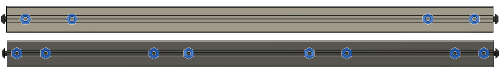

# Set up bottom Y extrusions

**Parts needed:**
* 2 extrusions with the label H
* 4 M3x8 BHCS
* 34 M3 nut
  
**Printed parts:**
* None

**Steps:**

1. Insert a M3x8 BHCS into each end of the extrusion, leaving about 2 mm clearance
2. Preload 2 M3 nuts into the top of the extrusion
3. Preload 7 M3 nuts into the bottom of the extrusion
4. Preload 4 M3 nuts into each side of the extrusion
5. Repeat for second extrusion

You should have the following for each lower Y extrusion:
* top: 2x3mm
* bottom: 7x3mm
* left side: 4x3mm
* right side: 4x3mm

# Assemble front left corner of frame 

**Parts needed:**
* Front bottom X extrusion (E) from previous step
* 1 bottom Y extrusion (H) from previous step
* 1 Z extrusion with rail (I) from previous step

**Steps:**

1. Attach extrusion E to extrusion I, and tighten the screw in the E extrusion
2. Attach extrusion H to extrusion I, and tighten the screw in the H extrusion

*Notes:*
* For all of the frame assembly steps, be sure to make all corners square, and use a flat surface to build on to ensure the extrusions are aligned

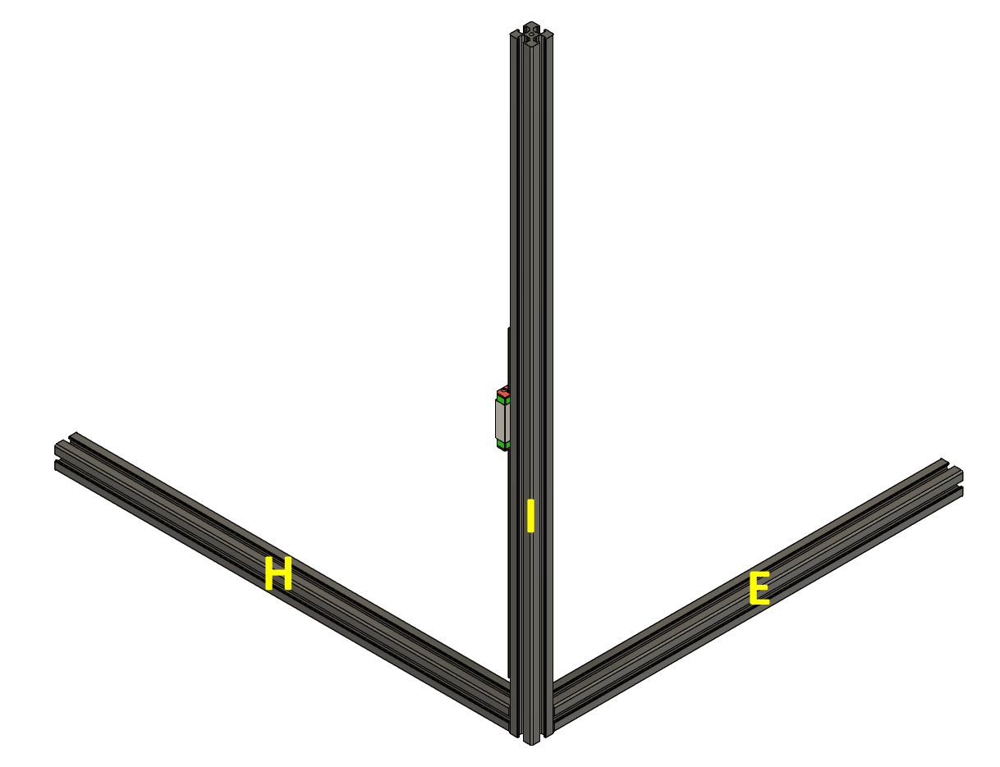

# Assemble front right corner of frame 

**Parts needed:**
* Frame assembly from previous step
* 1 bottom Y extrusion (H) from previous step
* 1 Z extrusion with rail (I) from previous step
* 4 M3 nuts 
  
**Steps:**
1. Preload 4 M3 nuts into the left side of extrusion I (facing the left side of the printer after assembled)
2. Attach extrusion I to extrusion E in the frame, and tighten the screw in the E extrusion
3. Attach extrusion H to extrusion I, and tighten the screw in the H extrusion

You should have the following preloaded into your righthand I extrusion:
* left: 4x3mm (inside) channel.

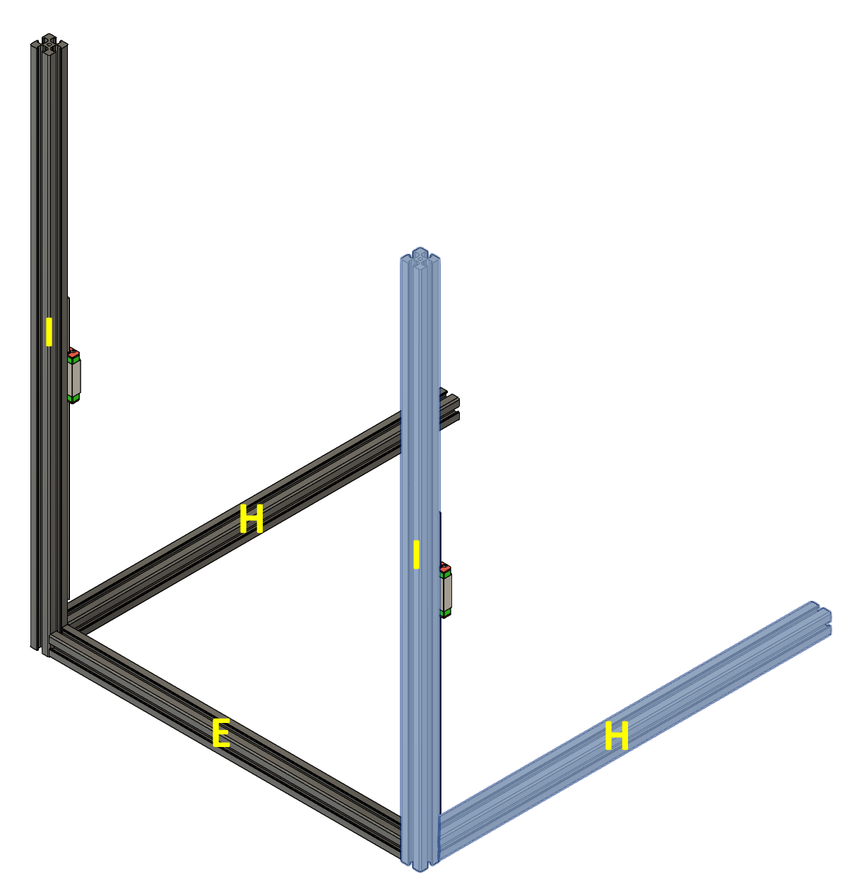

# Rear bottom Z assembly 

**Parts needed:**
* Frame assembly from previous step
* 1 extrusion G
* 1 extrusion C (with Z rail attached)
* 2 M3x8 BHCS
* 14 M3 nuts 
  
**Steps:**
1. Add one M3x8 BHCS into each end of the G extrusion, leaving about 2mm clearance 
2. Add 8 M3 nuts to the bottom of the G extrusion
3. Add 2 M3 nuts to the back of the G extrusion
3. Add 2 M3 nuts to the front of the G extrusion
4. Add 4 M3 nuts to the top of the G extrusion. Three of these should be on the left half, and one on the right half.
5. Attach the C extrusion to the middle of the G extrusion

You should have the following preloaded on the G extrusion:
* bottom: 8x3mm
* back: 2x3mm (If using the Fabreeko back panel, use 1x3mm instead)
* front: 2x3mm
* top left: 3x3mm
* top right: 1x3mm

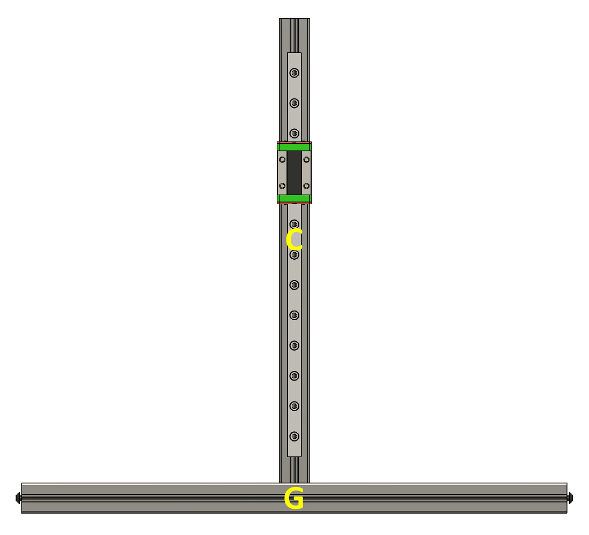

# Rear frame assembly 

**Parts needed:**
* Frame assembly from previous step
* Rear z assembly from previous step
* 2 extrusion J

**Steps:**
1. Attach J extrusions to back of the frame assembly 
2. Attach rear z assembly to the two J extrusions

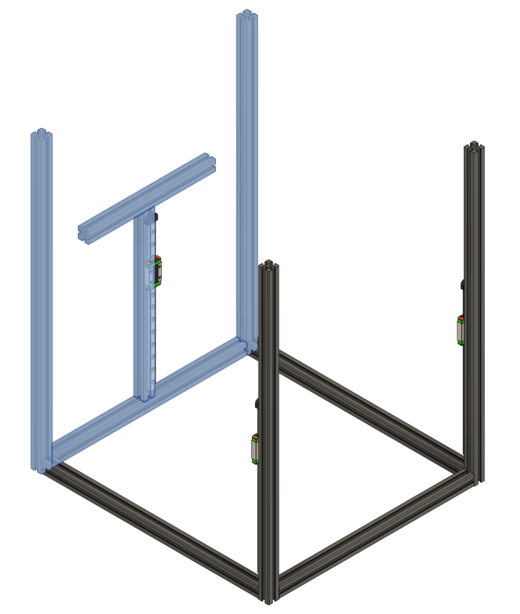

# Prepare Y axis rails

**Parts needed:**
* 2 extrusion H
* 2 MGN7H rails (200mm for 120 build, 230mm for 160 build)
* 14 M2 nuts for 120 build, 16 if 160 build
* 14 M2x6 BHCS, 16 if 160 build
* 6 M3x8 BHCS
* 18 M3 nut (+18 extra if installing backers)
  
**Printed parts:**
* 2 Rail stops ([a]_railstop)
* 2 Y rail nut holders (y_rail_nut_holder_230)
* 2 MGN7 rail guides (MGN7_Rail_Guide)

**Steps:**
1. Put 7 (or 8 if 160 build) M2 nuts in each y rail nut holder, skipping every other hole
2. Insert rail nut holder into extrusion
3. Attach MGN7H rail with M2 BHCS
4. Use the MGN7 rail guide parts to center the rail on the extrusion
5. Align one end of rail 24mm from the end of the extrusion before tightening screws. 
6. Using a M3x8 BHCS and M3 nut, attach the railstop to the opposite end of the rail
7. Add one M3x8 BHCS to each end of the extrusion, leaving a 2mm gap 
8. Preload 2 M3 nuts onto the top and 2 M3 nuts into the bottom of the rail between the railstop and the end of the extrusion
9. Preload 2 M3 nuts onto the top and 2 M3 nuts into bottom of the rail on the opposite end from the railstop
10. Preload an additional 9 M3 nuts into the top of the rail, if installing backers
11. Repeat for second extrusion
12. **Be careful to not let the rail carriage slide off the rail**

You should have the following preloaded on the H extrusions:
* top: 4x3mm (or 13, if installing backers)
* bottom front: 2x3mm
* bottom back: 2x3mm
* outer side: 2x3mm

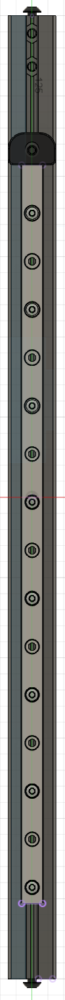

# Attach the Y axis extrusions 

**Parts needed:**
* 2 Y axis extrusion H with rails attached from previous step
* Frame from previous step

**Steps:**
1. Attach each extrusion H between extrusons I and J, the exact distance to the top of the frame will be set later. The rails should be facing the _bottom_ of the frame, with the printed endstops closest to the front rails.

# Attach the top extrusions 

**Parts needed:**
* 2 extrusion H
* 2 extrusion E
* 28 M3 nuts
* 8 M3x8 BHCS

**Steps:**
1. Preload 4 nuts into the top of each extrusion (2x extrusion H _and_ 2x extrusion E).
2. Preload 4 nuts into one side of two extrusion H. These will face the outside of the printer
3. Preload 2 nuts into one side of one extrusion E. This will face the outside of the printer (1 if using fabreeko back panel)
4. Preload 2 nuts into the bottom of the same E extrusion (this will go in the rear of the frame, skip if using fabreeko back panel)
5. Add one M3x8 BHCS to each end of each extrusion, leaving a 2mm gap 
6. Attach the extrusions to the frame, making sure that the preloaded nuts are on the top and _outside_ faces of the extrusions, and that the extrusion with 2 nuts on the bottom is in the rear of the frame. 
7. Ensure that the top of the extrusions is level and square with the rest of the frame.

You should have the following preloaded on both H extrusions:
* top: 4x3mm
* outer side 4x3mm

You should have the following preloaded on front E extrusion:
* top: 4x3mm

You should have the following preloaded on rear E extrusion: (Rear)
* top: 4x3mm
* outer side: 2x3mm (If using the Fabreeko back panel, use 1x3mm instead)
* bottom: 2x3mm (If using the Fabreeko back panel, skip)

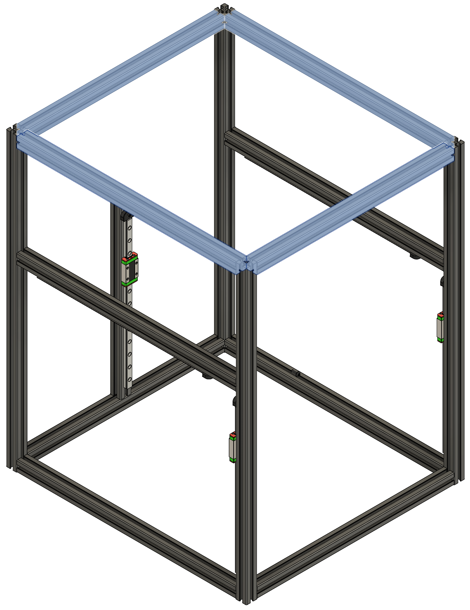

# Align the Y extrusions

**Parts needed:**
* Frame
* 2 Y axis spacers (y_axis_spacer)

**Steps:**
1. Loosen the screws holding the Y axis extrusions to the frame
2. Insert the Y axis spacers between the top extrusion and the Y axis extrusion
3. Adjust height of the Y axis extrusion so that the extrusion is parallel to the top and the spacer parts fit snugly
4. Tighten the screws to lock the Y axis extrusion in place 
5. Remove the Y axis spacers and repeat for the other side

# Frame complete!

It's recommended to watch this video on ensuring squareness of the frame, and make sure that your frame is as square as possible. This makes assembly easier and reduces troubleshooting issues later with print quality. [Nero 3D - Building Your Frame Square and True - Setup for sucess!](https://www.youtube.com/watch?v=GSg7RDLgYV0&list=PL7zrGeKp_8CR7oSREn46GCAteJdN9XGzW&index=2&t=5s)

