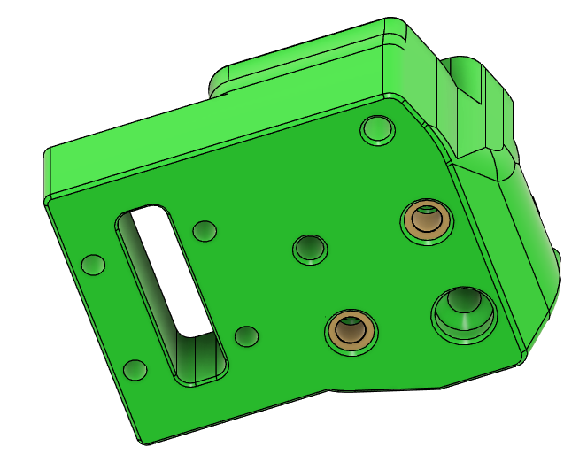
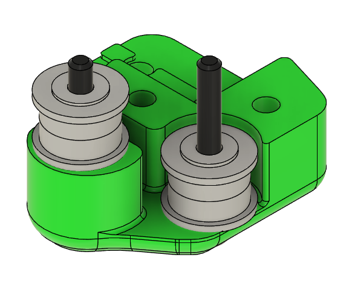
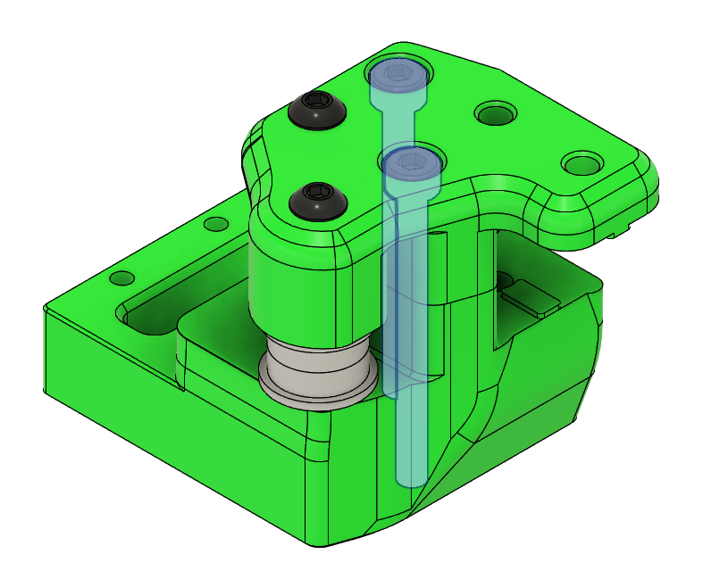
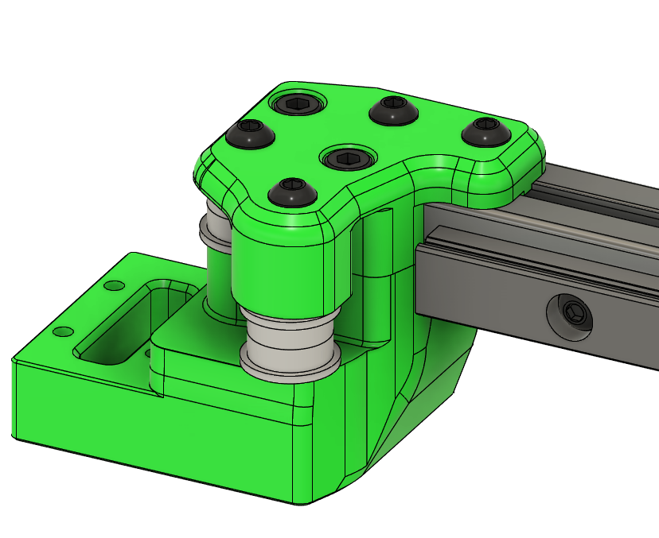
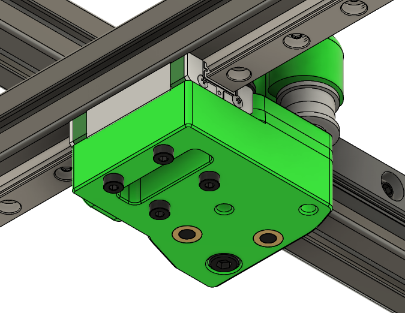

# Prepare the X axis extrusion

**Parts needed:**
* 1 extrusion with the label D
* 1 X rail (MGN9C-180 for 120 build, MGN9C-210 for 160 build)
* 6 M3x6 BHCS
* 6 M3 nuts
  
**Printed parts:**
* 2 MGN9 rail guides (MGN9_1515_Rail_Guide)

**Steps:**

1. Using 6 M3 nuts and M3x6 BHCS, add the MGN9C rail to extrusion D, leaving about 15mm from the end
2. Use the MGN9 rail guides to center the rail in the extrusion
3. Tighten the screws starting from the center and work toward the ends
4. **Be careful to not let the rail carriage slide off the rail**

# Assemble the left XY joint

**Parts needed:**
* 2 M3 heatset nuts
* 2 M3x35 SHCS 
* 2 M3x25 BHCS
* 4 M3 washers
* 4 F623 bearings

**Printed parts:**
* 1 xy_joint_left_lower
* 1 xy_joint_left_upper

**Steps:**
1. Insert two heatsets into the xy_joint_left_lower 
2. Using 2 M3x25 BHCS, assemble two bearing stacks on the xy_joint_left_upper. Don't over-tighten these screws, the bearings are intended to have some freedom of movement 
3. Uses 2 M3x35 SHCS to attach the xy_joint_left_lower to the xy_joint_left_upper 
   

# Assemble the right XY joint

**Parts needed:**
* 2 M3 heatset nuts
* 2 M3x35 SHCS 
* 2 M3x25 BHCS
* 4 M3 washers
* 4 F623 bearings

**Printed parts:**
* 1 xy_joint_right_lower
* 1 xy_joint_right_upper

**Steps:**
1. Insert two heatsets into the xy_joint_right_lower 
2. Using 2 M3x25 BHCS, assemble two bearing stacks on the xy_joint_right_upper. Don't over-tighten these screws, the bearings are intended to have some freedom of movement 
3. Uses 2 M3x35 SHCS to attach the xy_joint_right_lower to the xy_joint_right_upper 

# Attach the XY joints

**Parts needed:**
* Left XY joint
* Right XY joint
* Extrusion D
* 4 M3x8 BHCS
* 2 M3x20 SHCS
* 6 M3 nuts
* 8 M2x12 SHCS      

**Steps:**
1. Use 2 M3x8 BHCS and 2 M3 nuts to attach the left XY joint to the D extrusion through the top 
2. Use 1 M3x20 SHCS and 1 M3 nut to attach to the extrusion from the bottom
3. Repeat for the right XY joint
4. Use 4 M2x12 SHCS on each side to attach the assembly to the Y rails 

# Make sure movement is smooth

At this point, slide the X axis forward and back by hand to ensure the movement is smooth, with no rough spots or tension. If there is any binding, make sure the Y rails are parallel and centered.