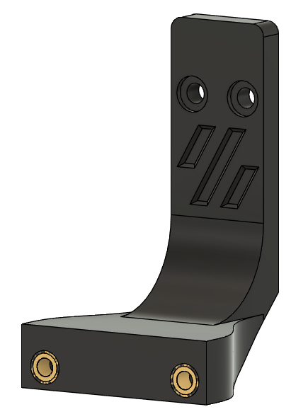
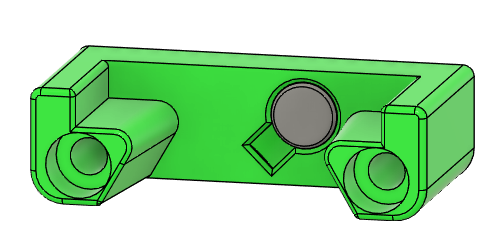
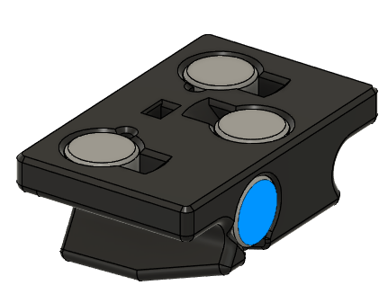
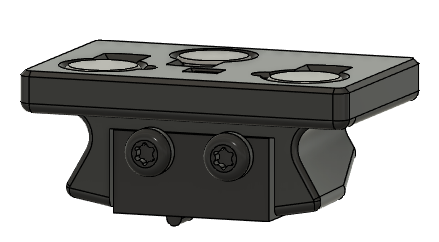
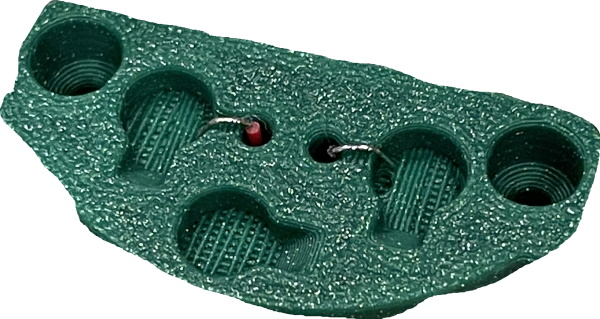
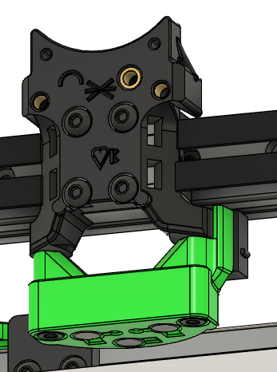

# Klicky dock mount

**Note**

While this is one method of managing z levelling, it is more complicated in it's implementation than https://github.com/PrintersForAnts/Boop.
If you want to use Klicky, keep reading, otherwise check out the instructions above.  If you use boop, you will end up with 2 unused nuts on the B mount, which could be used for a camera or sensor.  You also would not use the klicky parts, or the stock X carriage.  If you use endstops, remember to print a boop carriage that supports them.

Please also note the X endstop is on the klicky mount (x_carriage_lower_x1.stl).

**Parts needed:**
* 2 M3 heatsets 
* 2 M3x8 BHCS

**Printed parts:**
* 1 dock_mount

**Steps:**
1. Insert two M3 heatsets into the dock mount 

2. Using M3x8 BHCS, attach the dock mount to the B extrusion, aligning the tab in the top of the B mount with the recess in the back of the dock
### MAKE SURE THE DOCK IS ALIGNED WITH THE TAB ON THE _B MOUNT_!!!

# Attach the klicky dock

**Parts needed:**
* 1 6x3 magnet
* 2 M3x20 SHCS

**Printed parts:**
* 1 probe_dock

**Steps:**
1. Insert a 6x3 magnet into the probe_dock. Use a small drop of glue to prevent it from moving. The polarity of this magnet is not important right now. 

2. Use the M3x20 SHCS to attach the dock to the mount 

# Build the klicky probe

**Parts needed:**
* 4 6x3 magnet
* 2 M2x10 self tapping screws
* 1 D2F switch

**Printed parts:**
* 1 probe_body

**Steps:**
1. Insert magnets into the top of the probe. The polarity is important, the magnets with matching colors in this picture must have the same polarity, and the one with a different color must have opposite polarity.  For people with color blindness, the 2 outer magnets should be the same polarity, and the centered magnet should be the opposite polarity.

2. Add the magnet to the back of the probe. This magnet must be aligned so that it is attracted to the magnet in the dock that was added in the previous step. The probe should snap cleanly into the dock and be retained by these magnets. Use some glue to retain these magnets in place 

3. Make sure that the magnets on top of the klicky probe are flat and level, and use some glue to hold them in place
4. Remove the lever from the d2f switch. This can be done with a set of needlenose pliers, just squeeze the lever from the sides where it attaches to the switch body to release it
5. Attach the switch using 2 M2x10 self tapping screws. The legs from the switch should be in contact with the magnets on the top of the probe body

# Lower carriage mount

**Parts needed:**
* 1 D2F switch  (Skip if using sensorless homing)
* 1 M2x10 self tapping screw (Skip if using sensorless homing)
* 2 M3x16 SHCS
* 3 6x3 magnets
* 24 gauge wire

**Printed parts:**
* 1 x_carriage_lower

**Steps:**
1. Prepare 2 lengths of wire, about 20cm long. Strip about 5mm from one end of each 
2. Insert the wires through the center holes, and hook the bare end through the cutout channel into the magnet area. Make sure there is enough wire in the magnet hole to make a solid connection to the magnet when it's in place 

3. Insert magnets into the 3 holes, with the matching polarity as the klicky probe previously. Each magnet should be attracted to it's corresponding one on the klicky probe. 
4. When the magnets are level and in the correct polarity, use a small amount of glue to fix them in place. 
5. Prepare 2 more lengths of wire, again about 20cm, and solder them to the outside contacts of the D2F switch.  Your switch MAY need the arm attached, orientation remains the same with or without it.
6. OPTIONAL: Using an M2x10 screw, mount the switch to the side of the lower carriage 

7. Use the M3x16 screws to attach the lower carriage to the upper carriage 

