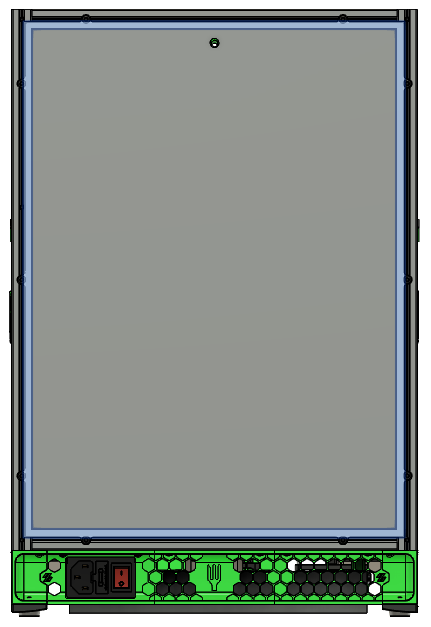
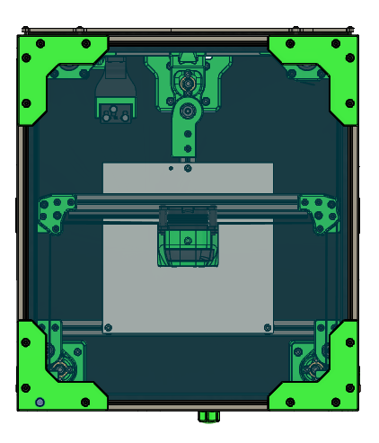
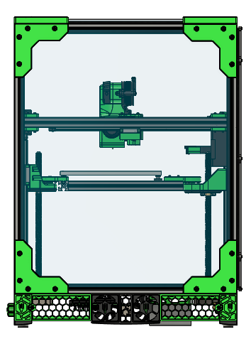
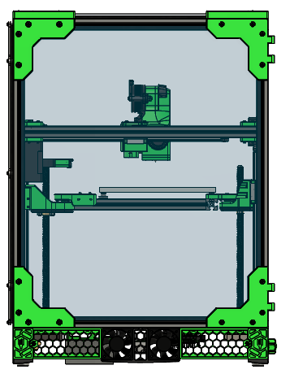
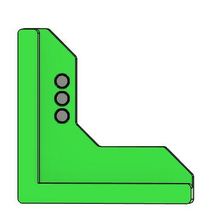
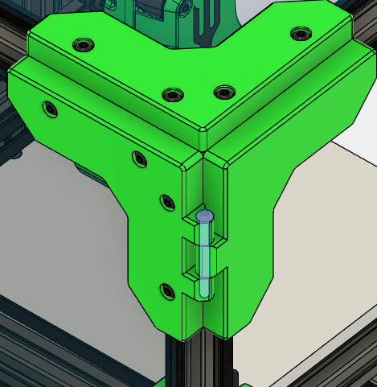
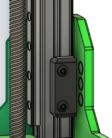

# Attach the back panel

**Parts needed:**
* 1 3mm pre-cut rear panel
* 3mm thick foam tape
* 10 M3x10 BHCS
* 6 M3 nuts

**Steps:**

1. Line the edges of the rear panel with 3mm foam
2. Preload 3 M3 nuts into the rear of the two extrusion J's in the rear of the printer
3. Mount the rear panel using the M3x10 BHCS. These should squish the foam slightly to make a nice seal to the frame. The highlights in this image show the location of the foam 

# Attach the top panel

**Parts needed:**
* 1 3mm pre-cut acrylic top panel
* 3mm thick foam tape
* VHB tape
* 16 M3x12 BHCS

**Printed parts:**
* 4 panel_corner

**Steps:**
1. Line the edges of the acrylic panel with the 3mm foam
2. Center the acrylic panel on the top of the frame
3. Add a small bit of VHB tape to the inside of the panel_corner pieces, 2-3cm long
4. Using the M3x12 BHCS, add the panel_corner pieces to the printer. The VHB tape will stick to the acrylic panel keeping the corners in place when the panel is removed.

# Attach the right side panel
**Parts needed:**
* 1 3mm pre-cut acrylic side panel
* 3mm thick foam tape
* VHB tape
* 16 M3x12 BHCS

**Printed parts:**
* 4 panel_corner

**Steps:**
1. Line the edges of the acrylic panel with the 3mm foam
2. Center the acrylic panel on the right side of the frame
3. Add a small bit of VHB tape to the inside of the panel_corner pieces, 2-3cm long
4. Using the M3x12 BHCS, add the panel_corner pieces to the printer. The VHB tape will stick to the acrylic panel keeping the corners in place when the panel is removed.

# Attach the left side panel

**Parts needed:**
* 1 3mm pre-cut acrylic side panel
* 3mm thick foam tape
* VHB tape
* 16 M3x12 BHCS

**Printed parts:**
* 2 panel_corner
* 1 side_top_hinge
* 1 side_bottom_hinge

**Steps:**
1. Line the edges of the acrylic panel with the 3mm foam
2. Center the acrylic panel on the left side of the frame
3. Add a small bit of VHB tape to the inside of the each corner piece, 2-3cm long
4. Using the M3x12 BHCS, add the panel_corner pieces to the printer in the rear side.
5. Add the side_top_hinge and side_bottom_hinge to the front side of the panel

# Attach the door

**Parts needed:**
* 1 3mm pre-cut acrylic front panel
* 1mm thick foam tape
* VHB tape
* 12 6x3 magnets 
* 2 M3x35 BHCS
* 4 M3x12 BHCS

**Printed parts:**
* 1 door_top_hinge
* 1 door_bottom_hinge
* 1 door_top_right
* 1 door_bottom_right
* 2 door_retainer
  

**Steps:**
1. Line the edges of the acrylic panel with the 1mm foam
2. Add 3 magnets to the door_top_right and door_bottom_right parts. Make sure the polarity is the same for all of the magnets, and use a drop of glue to keep them in place 

3. Add 3 magnets to each of the door_retainer parts, align the polarity of the magnets so they are attacted to the door magnets and glue in place
4. Center the acrylic panel on the front side of the frame
5. Add a small bit of VHB tape to the inside of each corner piece, 2-3cm long
6. Add the corner pieces, and use 2 M3x35 BHCS to attach the hinges together 

7. Using 2 M3x12 BHCS each, mount the door_retainer assemblies to the extrusion I, aligning them with the magnets in the door 

