# Rear skirts

**Parts needed:**
* 4 M3x6 BHCS

**Printed parts:**
* 1 skirt_rear_left
* 1 skirt_120_rear_center or skirt_150_rear_center as appropriate for the size of your build

**Steps:**
1. Screw in the 4 M3x6 BHCS slightly into the pre-loaded nuts in the bottom of extrusion G, just enough to hold the screw
2. Slide the skirt_rear_left onto the screws, align it with the corner of the frame and tighten the screws 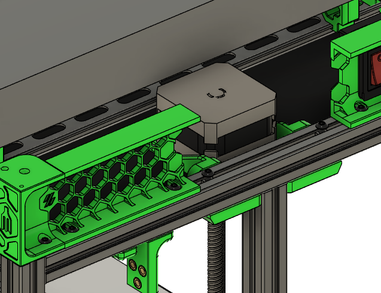
3. Slide the skirt center in place and tighten the screws there 
   

# Left skirts

**Parts needed:**
* 5 M3x6 BHCS
* 6 M3x8 SHCS
* 2 4010 axial fans

**Printed parts:**
* 1 skirt_side_a_120 or skirt_side_a_120 
* 1 skirt_side_b_150 or skirt_side_b_150
* 1 fan_support

**Steps:**
1. Screw in the 5 M3x6 BHCS slightly into the pre-loaded nuts in the bottom of extrusion H on the left side of the printer, just enough to hold the screw
2. Following the same procedure as the rear skirts, attach the skirt_side_b to the extrusion towards the back of the printer
3. Attach the skirt_side_a towards the front of the printer 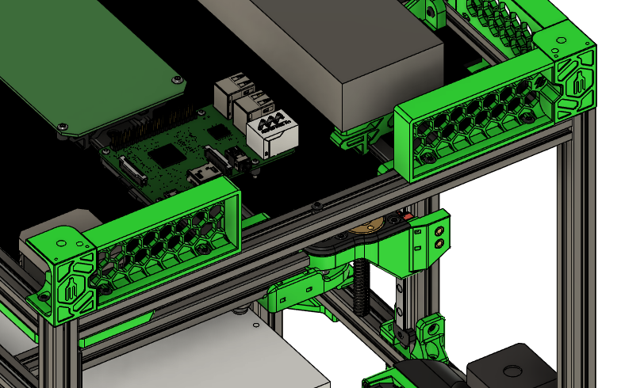
4. Mount the two 4010 axial fans to the fan_support piece using the M3x8 SHCS 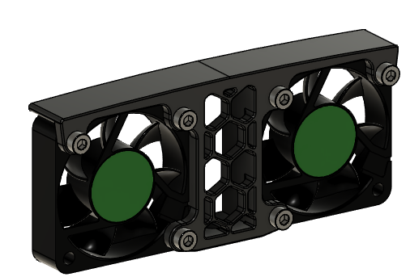
5. Mount the fan assembly to the extrusion 

# Right skirts

**Parts needed:**
* 5 M3x6 BHCS
* 6 M3x8 SHCS
  
**Printed parts:**
* 1 skirt_side_a_120 or skirt_side_a_120 
* 1 skirt_side_b_150 or skirt_side_b_150
* 1 fan_support
* 2 fan_blanks

**Steps:**
1. Screw in the 5 M3x6 BHCS slightly into the pre-loaded nuts in the bottom of extrusion H on the right side of the printer, just enough to hold the screw
2. Following the same procedure as the rear skirts, attach the skirt_side_a to the extrusion towards the back of the printer
3. Attach the skirt_side_b towards the front of the printer
4. Mount the two fan_blanks to the fan_support piece using the M3x8 SHCS 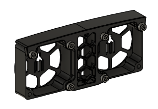
5. Mount the fan assembly to the extrusion 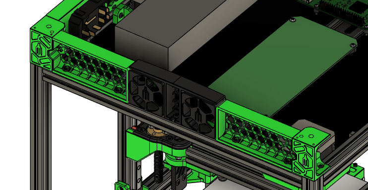

# Front skirts

**Parts needed:**
* 6 M3x6 BHCS

**Printed parts:**
* 1 skirt_120_front_left or skirt_150_front_left
* 1 skirt_120_front_right or skirt_150_front_right

**Steps:**
1. Screw in the 6 M3x6 BHCS slightly into the pre-loaded nuts in the bottom of extrusion E on the front side of the printer, just enough to hold the screw
2. Attach the skirt_front_left and skirt_front_right pieces and tighten the screws 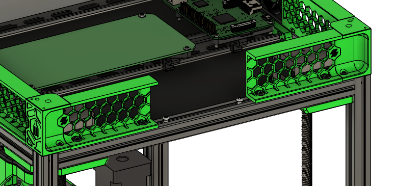

# Display assembly

**Parts needed:**
* 1 V0 display
* 4 M3x12 BHCS
* 4 M3 heatsets

**Printed parts:**
* 1 back_cover
* 1 spacer
* 1 display_bezel
* 1 stop_button
* 1 display_front
* 1 knob
* 1 display_hinge

**Steps:**
1. Add 4 M3 heatsets into the back_cover 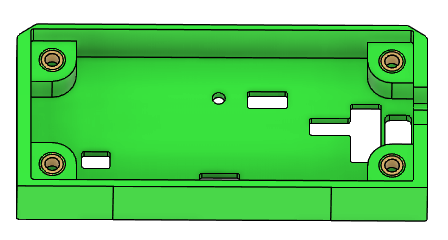
2. Insert the v0 display into the back_cover 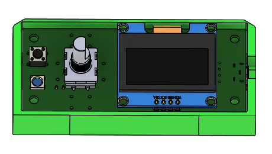
3. Add the spacer on top of the v0 display  
4. Add the stop_button 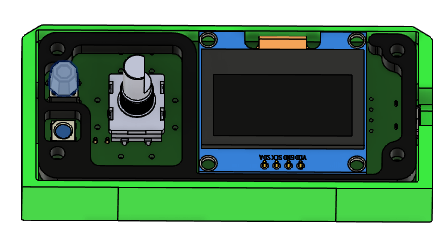
5. Add the display_bezel 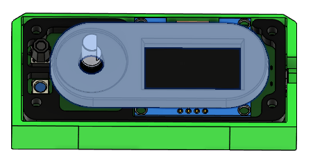
6. Attach the display_front using 4 M3x12 BHCS 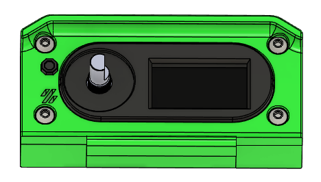
7. Add the knob 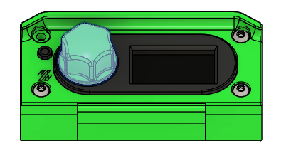
8. Using a paperclip, scrap filament or similar material as a hinge, attach the display_hinge to the assembly 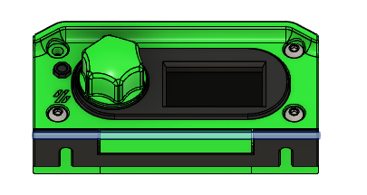
9. Attach the assembly to the printer 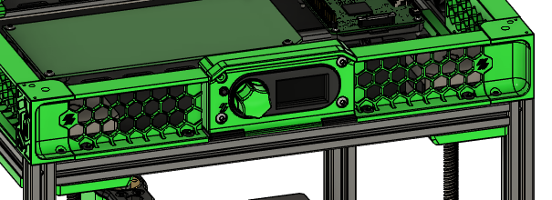

# Feet

**Parts needed:**
* 4 M5x10 BHCS
* 4 Rubber feet
* 8 M2x6 BHCS

**Printed parts:**
* 4 base_plate

**Steps:**
1. Add the base_plate to one leg using 2 M2x6 BHCS. One of the 3 screw holes on the base_plate will not be filled 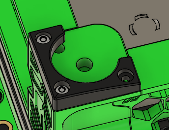
2. Using a M5x10 BHCS, attach a rubber foot to the printer 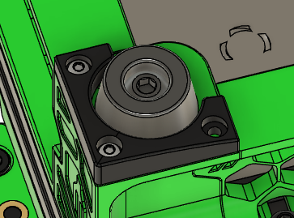
3. Repeat for the other 3 feet