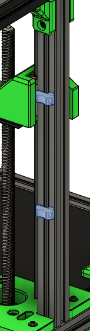

# Umbilical ties

**Printed parts:**
* 2 cable_tie_down_misumi or cable_tie_down_makerbeam depending on your extrusion type

**Steps:**
1. Add 2 cable_tie_down_misumi to the right side of extrusion C. Exact position is not important, these are used to secure the toolhead umbilical wires 

# Wiring

For now, follow standard Trident wiring instructions, with some small differences for the Salad Fork. 

* There is no 5v power supply
* Instead of an inductive probe, the klicky is used instead, so no BAT85 diode required
* Instead of cable chains, Salad Fork uses an umbilical routed up extrusion C
  