# Attach the lower drive mounts and rear extrusion

**Parts needed:**
* 8 M3x10 BHCS
* 1 Extrusion B  
* 16 M3 nuts
  
**Printed parts:**
* 1 A_Drive_Frame_Lower
* 1 B_Drive_Frame_Lower

** Note **

The pieces WITHOUT the countersunk screw holes are the lower parts.

**Steps:**
1. Attach the B_Drive_Frame_Lower to the left rear corner of the frame using 2 M3x10 BHCS
2. Attach the A_Drive_Frame_Lower to the right rear corner of the frame using 2 M3x10 BHCS

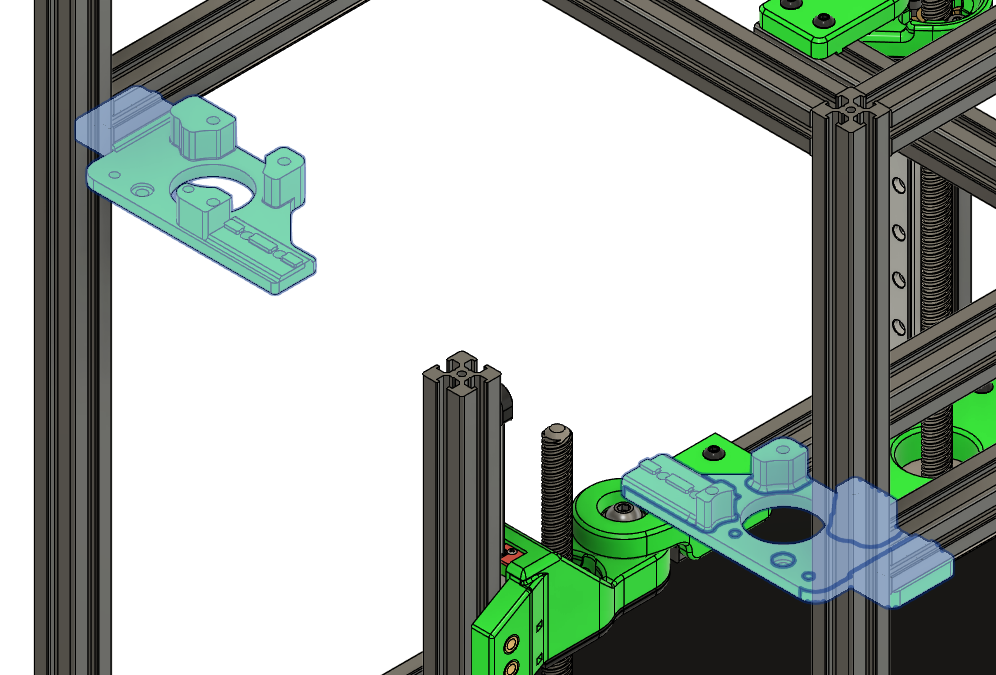

3. Preload 6 M3 nuts onto the top and 6 M3 nuts onto the bottom of extrusion B.
4. Preload 2 M3 nuts into the front of extrusion B
5. Preload 1 M3 nut into the left and 1 M3 nut into the right side of extrusion C (the one with the rear Z rail attached)
6. Center the extrusion B on the mounts and attach it with 2 M3x10 BHCS on each mount. The extrusion B will not sit flush with the extrusion C on the frame, this is intentional
7. Make sure the extrusion B is parallel with the corner extrusions. You can use a straightedge across the back of the printer to align it
8. Now you can gently tighten the screws on the rear Z carriage to hold extrusion B in it's proper orientation

You should have the following preloaded on extrusion B:
top: 6x3mm (put a screw in the outer ones, to keep them from falling out if you tilt the printer)
front: 2x3mm

You should have the following preloaded on extrusion C:
left: 1x3mm
right: 1x3mm

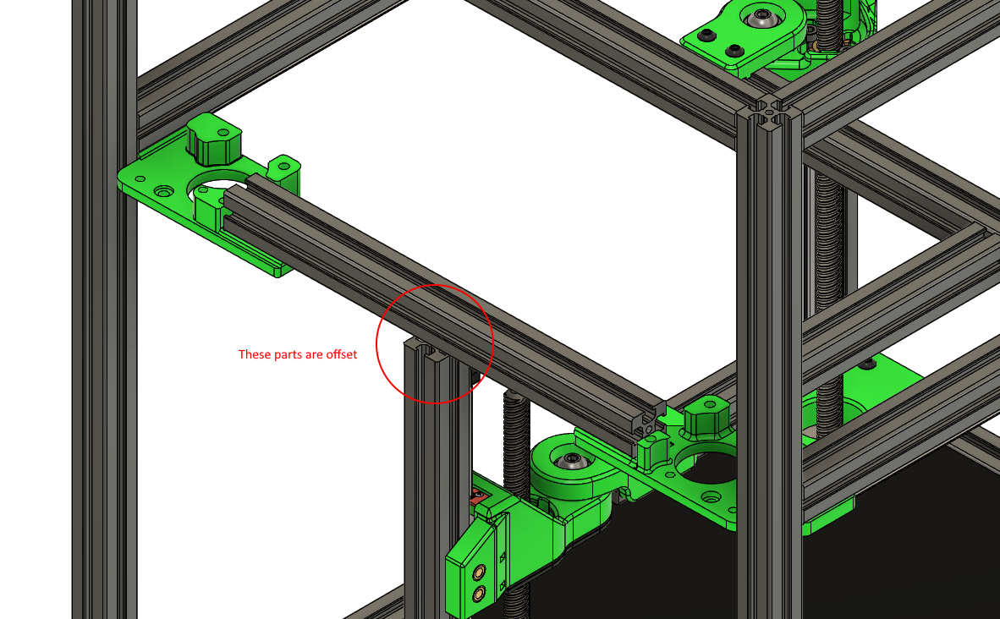

# Prepare the B drive stepper

**Parts needed:**
* 1 NEMA14 stepper motor
* 1 GT2 16T pulley

**Steps:**
1. Attach a GT2 16T to the stepper drive shaft. Align it as shown, with approx 1.2mm clearance from the stepper. This will be adjusted later when the belts are added
   

# Assemble the B motor mount

**Parts needed:**
* 6 F623 bearings
* 6 M3 washers
* 4 M3x10 BHCS
* 1 M3x6 BHCS
* 2 M3x25 BHCS
* 3 M3x25 SHCS
* 1 B motor assembly from previous step

* Note *

You may wish to assemble the bearing stacks against the upper printed part first.

To do so you'll want to tip the printer on it's face

Start the screws for the bearing stacks (M3x25 BHCS) first, but do not fully tighten (steps 4 and 5)

Stand the printer back on it's feet, then perform steps 1, 2 and 3.

**Printed parts:**
* 1 B_Drive_Frame_Upper

**Steps:**

1. Attach the motor assembly to the B_drive_Frame_lower using 1 M3x6 BHCS in the position shown. Orient the stepper so that the wires are on the left side (when viewed from the rear of the printer).

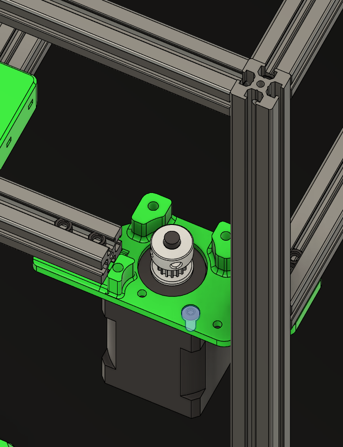

2. Using 3 M3x25 SHCS, attach the B_Drive_Frame_Upper 

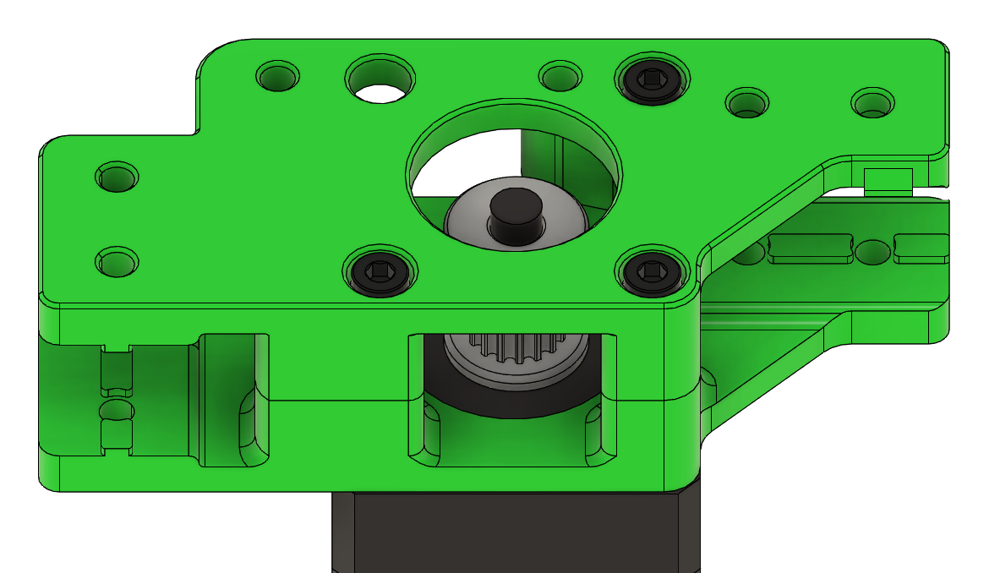

3. Add 4 M3x10 BHCS screws to attach the upper drive frame to the extrusions 

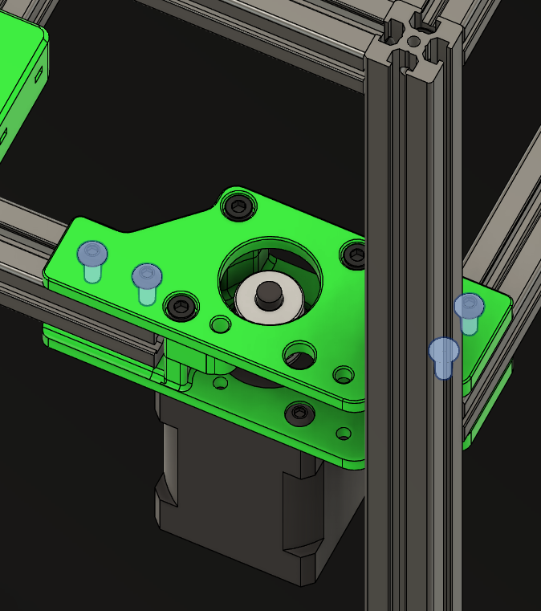

4. Use a M3x25 BHCS to mount a bearing stack in place. A bearing stack is a M3 washer, 2 F623 bearings, and another M3 washer 

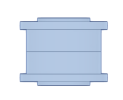 
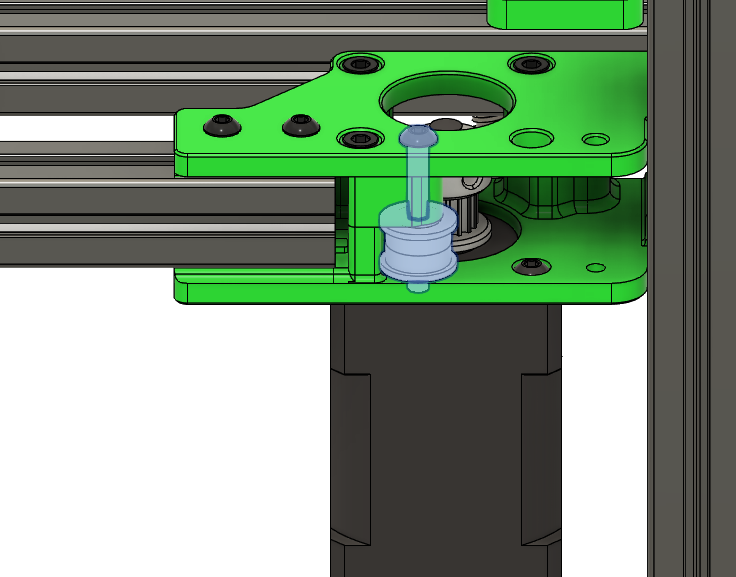

5. Use another M3x25 BHCS to mount two more bearing stacks 

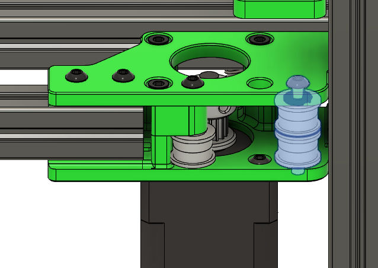

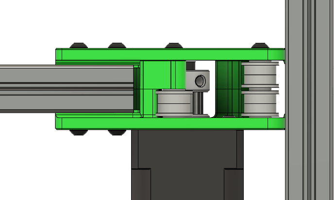

# Prepare the A drive stepper

**Parts needed:**
* 1 NEMA14 stepper motor
* 1 GT2 16T pulley

**Steps:**
1. Attach a GT2 16T to the stepper drive shaft. Align it as shown, with approx 4.8mm clearance from the stepper. This will be adjusted later when the belts are added
   

# Add the Y endstop switch 

**Parts needed:**
* 1 D2F switch
* 2 M2x10 self tapping screws
* 24 AWG wire (2 pieces of 60mm length)

**Printed parts:**
* 1 A_Drive_Frame_Upper

**Steps:**
1. Solder wire to the two outside contacts of the switch, these are normally labeled "NC" for "Normally closed". Using the NC pins is a safety measure to prevent printer damage in the event of a broken wire. 
2. Attach the switch to the upper motor mount using M2x10 self tapping screws.  

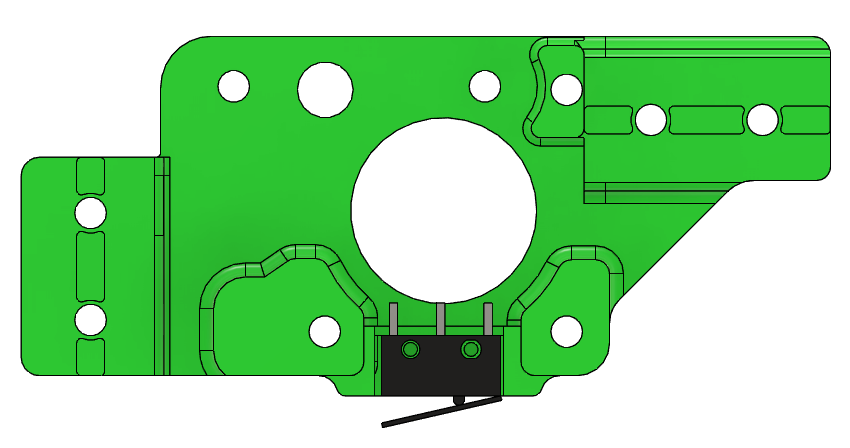

# Assemble the A motor mount

**Parts needed:**
* 6 F623 bearings
* 6 M3 washers
* 4 M3x10 BHCS
* 1 M3x6 BHCS
* 2 M3x25 BHCS
* 3 M3x25 SHCS
* 1 A motor assembly from previous step

**Printed parts:**
* 1 A_Drive_Frame_Upper

* Note *
DID YOU REMEMBER TO ADD THE Y ENDSTOP? If not, scroll back up and do that first.

You may wish to assemble the bearing stacks against the upper printed part first.

To do so you'll want to tip the printer on it's face

Start the screws for the bearing stacks (M3x25 BHCS) first, but do not fully tighten (steps 4 and 5)

Stand the printer back on it's feet, then perform steps 1, 2 and 3.

**Steps:**

1. Attach the motor assembly to the A_drive_Frame_lower using 1 M3x6 BHCS in the position shown. Orient the stepper so that the wires are on the right side 

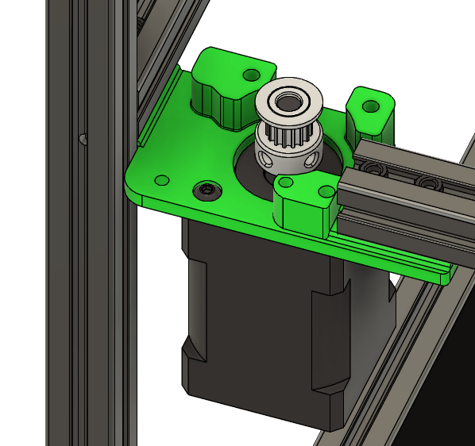

2. Using 3 M3x25 SHCS, attach the A_Drive_Frame_Upper. In the newer A_drive_Frame_lower design, there is a slot between the stepper and the frame. Route the endstop cabling through this.

3. Add 4 M3x10 BHCS screws to attach the upper drive frame to the extrusions 

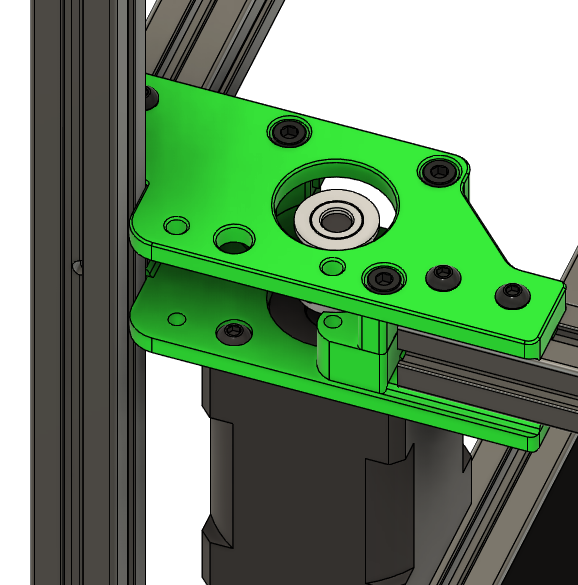

4. Use a M3x25 BHCS to mount a bearing stack in place. A bearing stack is a M3 washer, 2 F623 bearings, and another M3 washer 

 
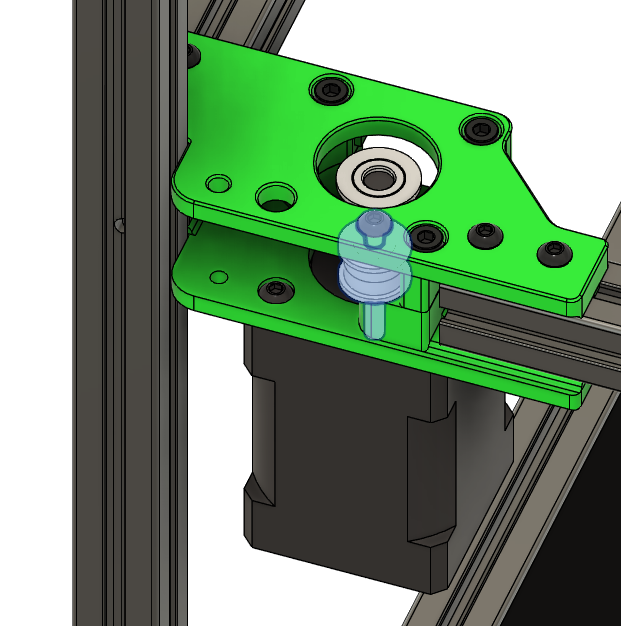

5. Use another M3x25 BHCS to mount two more bearing stacks 

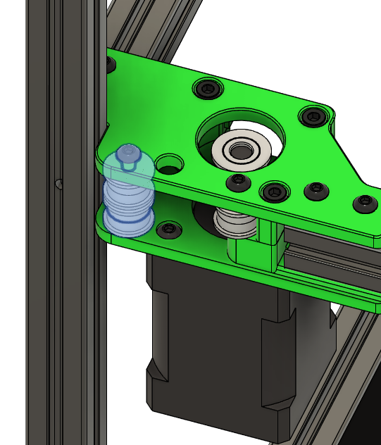

# Prepare the idler tensioners

**Parts needed:**
* 4 M3 heatsets

**Printed parts:**
* 1 tensioner_a
* 1 tensioner_b

**Steps:**
1. Insert 2 heatsets into each tensioner part 

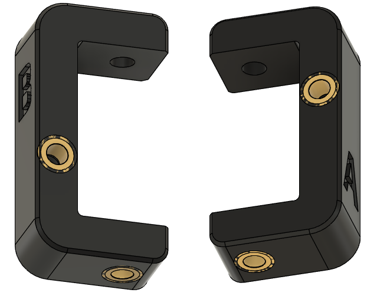

# Attach the B idler

**Parts needed:**
* 4 M3x10 BHCS
* 3 M3 washers
* 2 F623 bearings
* 1 M3x35 BHCS
* 1 M3x25 BHCS
  
**Printed parts:**
* 1 tensioner_top
* 1 tensioner_bottom
* 1 tensioner_b

**Steps:**
1. Attach the tensioner_top to the front left of the printer, on the underside of the extrusion as shown using 2 M3x10 BHCS 

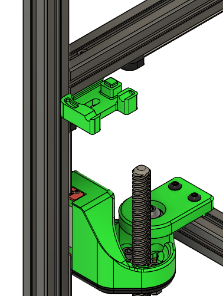

2. Assemble a bearing stack using 2 M3 washers and 2 F623 bearings, place it on the mounted tensioner_top piece and use a screw to align it with the cutout for later 

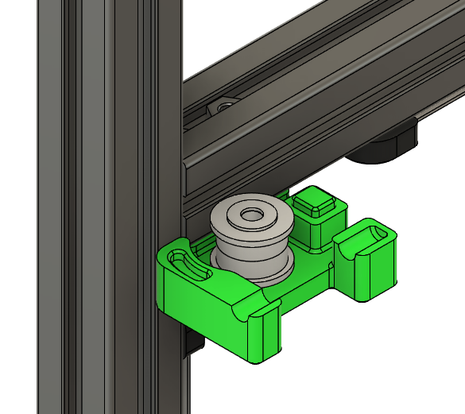

3. Attach the tensioner_bottom to the frame using M3x8 BHCS. Be careful to not dislodge the bearing stack.  A paperclip can be used to straighten the stack if it's shifted.

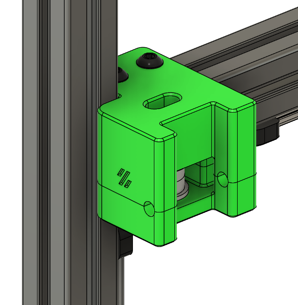

4. Add the tensioner_b part to the assembly, aligning the hole with the bearing stack. Use a M3x35 BHCS to fasten it in place 

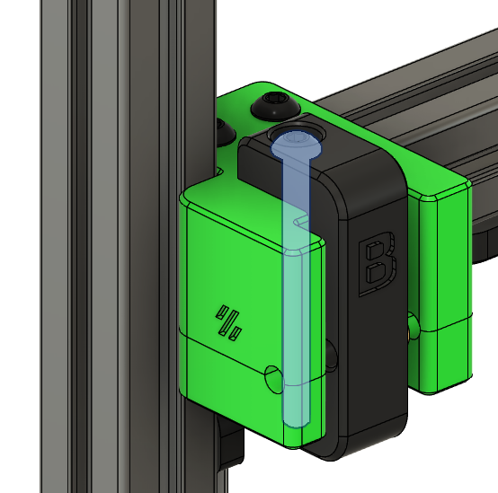

5. Thread a M3 washer and a M3x25 BHCS into the tensioner to finalize the idler assembly 

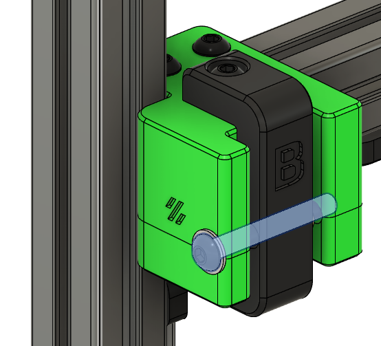

# Attach the A idler

**Parts needed:**
* 4 M3x10 BHCS
* 3 M3 washers
* 2 F623 bearings
* 1 M3x35 BHCS
* 1 M3x25 BHCS
  
**Printed parts:**
* 1 tensioner_top
* 1 tensioner_bottom
* 1 tensioner_a

**Steps:**
1. Attach the tensioner_bottom to the front right of the printer, on the underside of the extrusion as shown using 2 M3x10 BHCS 

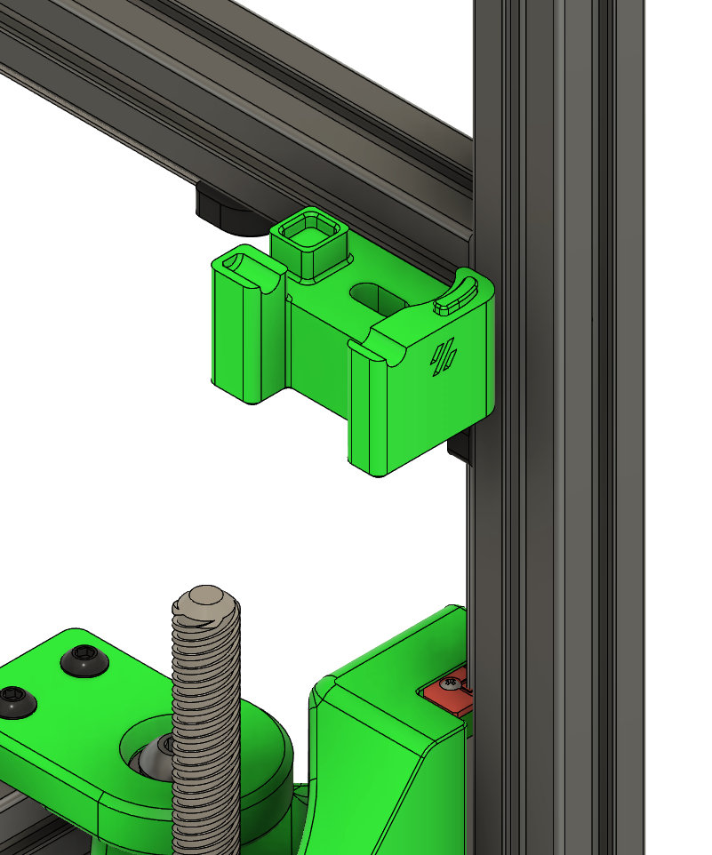

2. Assemble a bearing stack using 2 M3 washers and 2 F623 bearings, place it on the mounted tensioner_bottom piece and use a screw to align it with the cutout for later 

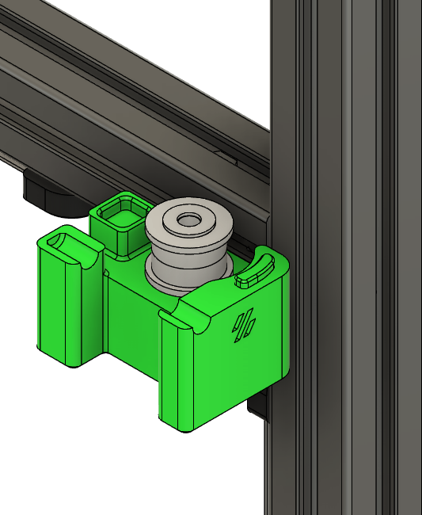

3. Attach the tensioner_top to the frame using M3x8 BHCS. Be careful to not dislodge the bearing stack.  A paperclip can be used to straighten the stack if it's shifted.

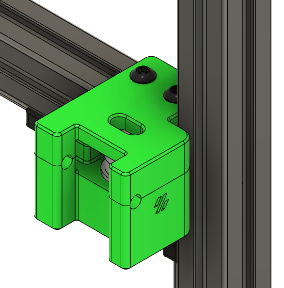

4. Add the tensioner_a part to the assembly, aligning the hole with the bearing stack. Use a M3x35 BHCS to fasten it in place 

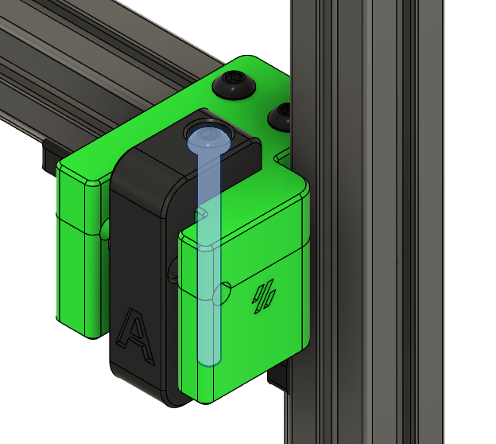

5. Thread a M3 washer and a M3x25 BHCS into the tensioner to finalize the idler assembly 

# Attach rear Z brackets and misc parts

**Parts needed:**
* 2 M3x6 BHCS
* 2 M3x8 BHCS
* 4 M3x6 SHCS

**Printed parts:**
* 1 z_spacer: Note that this does not fit makerbeam extrusions but can be trimmed.
* 1 z_bracket_left
* 1 z_bracket_right
* 1 bowden_mount
* 1 umbilical_mount

**Steps:**
1. Flip the printer to the left.  Install the z_bracket_right to extrusion C using M3x6 BHCS, but leave it loose.

2. Flip the printer to the right.  Install the z_bracket_left to extrusion C using M3x6 BHCS, but leave it loose.

3. Flip the printer upside down.

4. Press the z_spacer between extrusions B and C as shown

5. Screw z_bracket_right and z_bracket_left to the z_spacer, using 1 M3x6 BHCS for each.

6. Put the printer back on it's feet.

7. With 2 M3x6 SHCS, mount the umbilical_mount on top of extrusion B, centered over extrusion C 

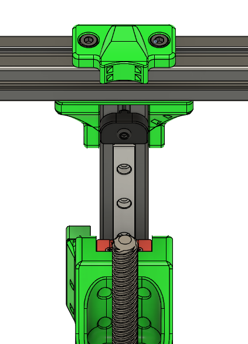

8. Add the bowden_mount to the bottom of the top rear extrusion E, also centered over extrusion C using 2 M3x6 SHCS (if not using the fabreeko back)

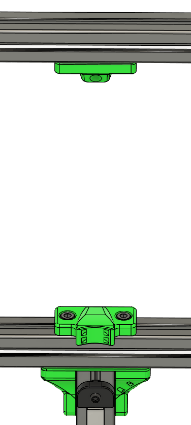
