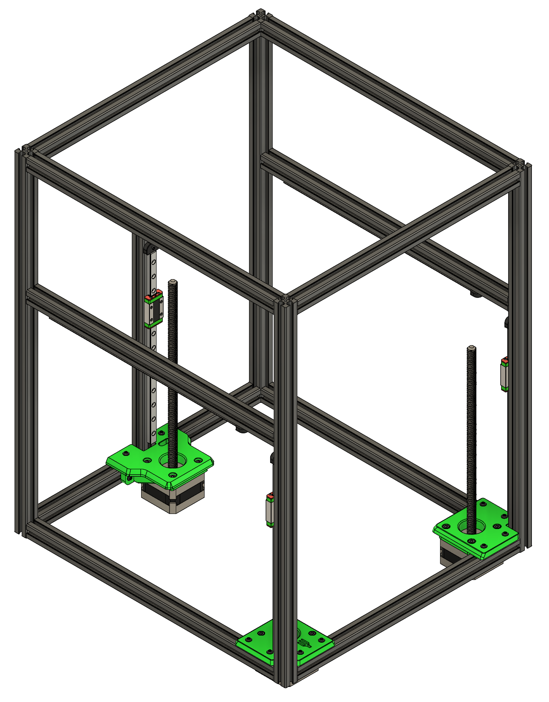
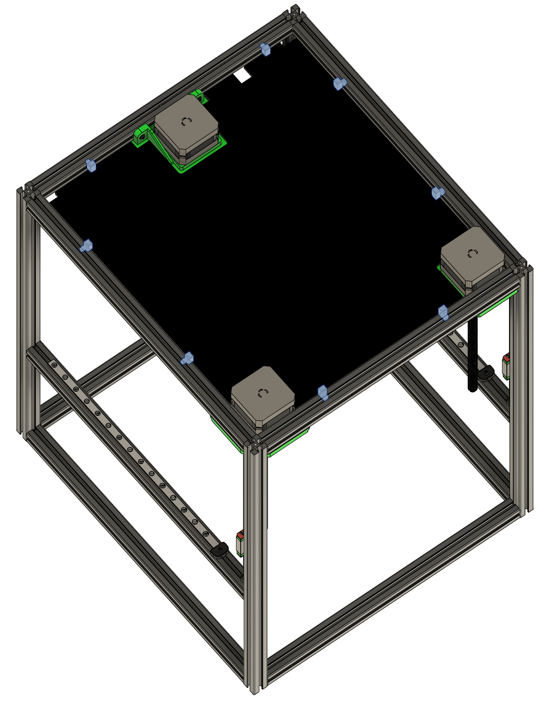
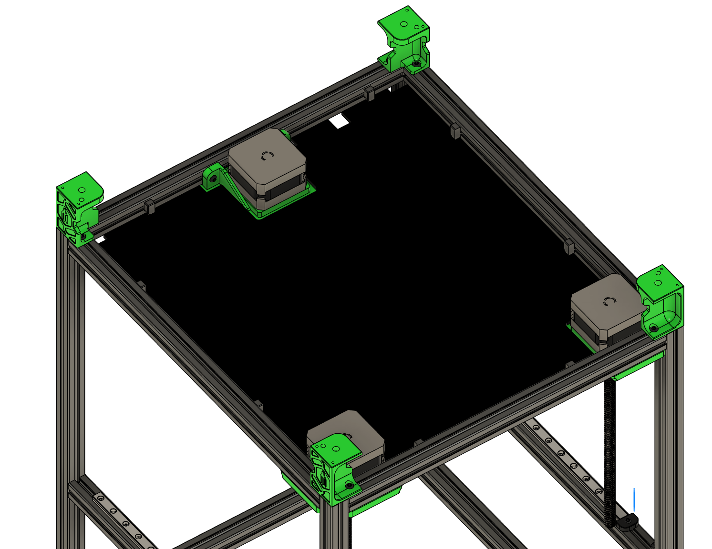
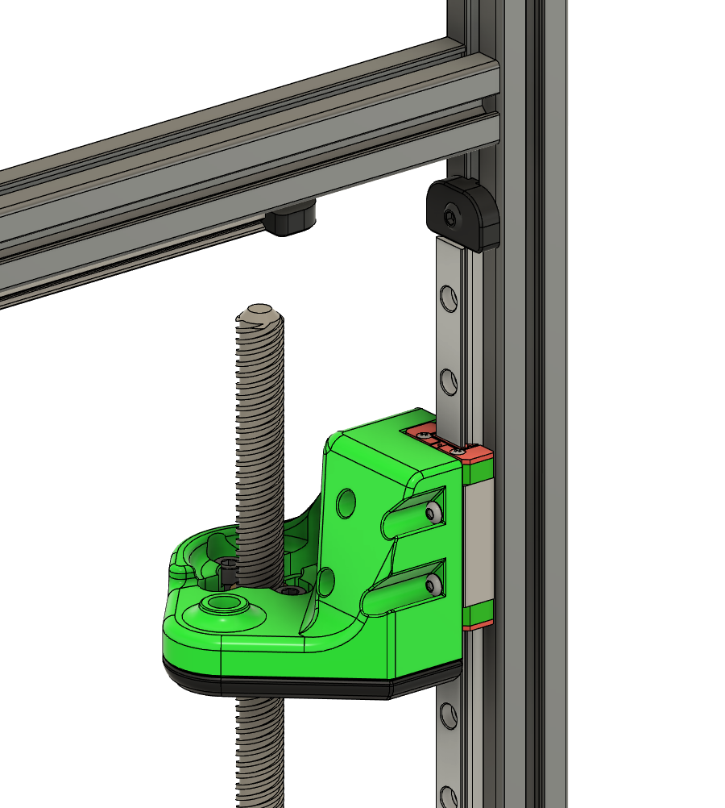
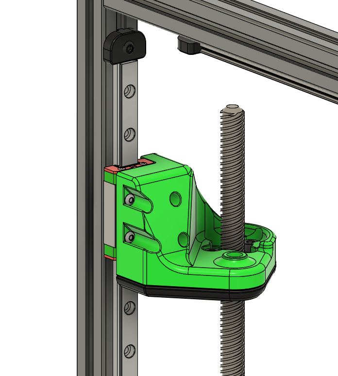
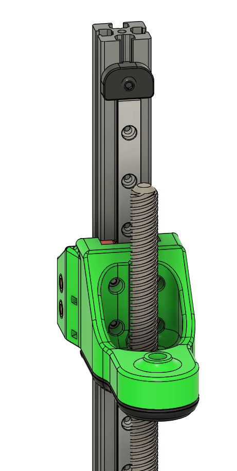
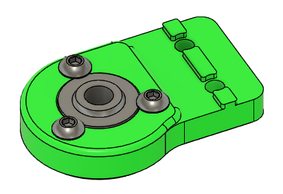
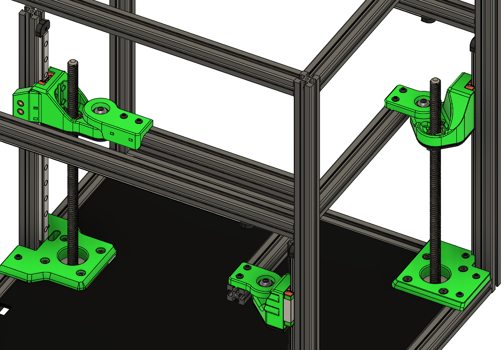
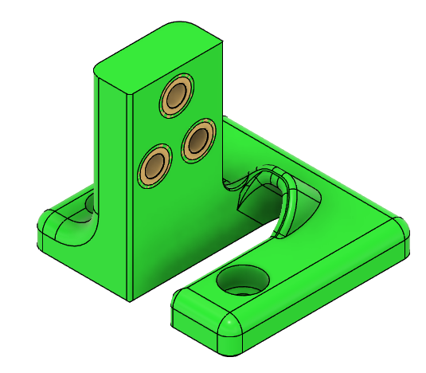
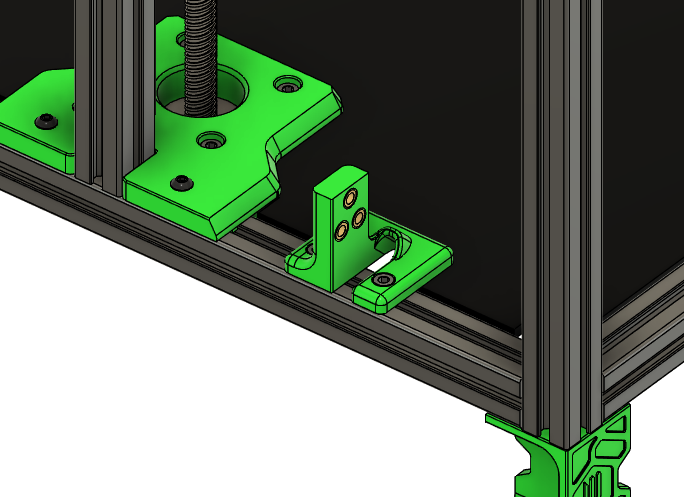

# Install Z steppers

**Parts needed:**
* 12 M3x12 SHCS 
* 12 M3x10 BHCS
* 3 Nema-17-200 steppers
  
**Printed parts:**
* 1 z_motor_mount_left
* 1 z_motor_mount_right
* 1 z_motor_mount_rear

**Steps:**

1. Attach a motor mount to each stepper using M3x12 SHCS screws
2. Attach motors to frame using M3x10 BHCS screws. For the rear stepper, use the right 2 preloaded nuts. There should be 2 nuts remaining to the left of the motor mount, we will attach the cable chain anchor here later.

# Attach deck panel

**Parts needed:**
* Deck panel 
  
**Printed parts:**
* 8 deck_support_misumi

**Steps:**
1. Flip the frame upside down for this step
2. Lay the deck plate down, it will be supported by the Z steppers
3. Fix it in place by adding 2 of the printed deck supports to each side, positioning is not critical

# Attach the feet

**Parts needed:**
* 8 M3x6 BHCS

**Printed parts:**
* 2 Leg_A
* 2 Leg_B

**Steps:**
1. Attach the feet using M3x6 BHCS, pay close attention to the orientation of the parts as shown in the image below

# Left Z carriage

**Parts needed:**
* 4 M2x6 BHCS
* 3 M3x6 BHCS
* 1 Leadscrew nut
* 2 M3x12 SHCS
* 2 M3 Nylock nuts 
  
**Printed parts:**
* 1 z_carriage_left
* 1 [a]_z_carriage_left

**Steps:**
2. Attach the accent piece to the main piece using 3 M3x6 BHCS screws
3. Thread the leadscrew nut onto the left Z stepper shaft
4. Attach the printed parts to the rail carriage using 4 M2x6 BHCS screws
5. Attach the printed parts to the leadscrew nut using 2 M3x12 SCHS screws and the M3 nylock nuts. These should be slightly snug but not tight. There should be enough looseness for the nut to slide slightly in the printed carriage part.

# Right Z carriage

**Parts needed:**
* 4 M2x6 BHCS
* 3 M3x6 BHCS
* 1 Leadscrew nut
* 2 M3x12 SHCS
* 2 M3 Nylock nuts 
  
**Printed parts:**
* 1 z_carriage_right
* 1 [a]_z_carriage_right

**Steps:**
3. Attach the accent piece to the main piece using 3 M3x6 BHCS screws
4. Thread the leadscrew nut onto the right Z stepper shaft
5. Attach the printed parts to the rail carriage using 4 M2x6 BHCS screws
6. Attach the printed parts to the leadscrew nut using 2 M3x12 SCHS screws and the M3 nylock nuts. These should be slightly snug but not tight. There should be enough looseness for the nut to slide slightly in the printed carriage part.

# Rear Z carriage 

**Parts needed:**
* 4 M2x6 BHCS
* 4 M3x6 BHCS
* 1 Leadscrew nut
* 2 M3x12 SHCS
* 2 M3 Nylock nuts 
  

**Printed parts:**
* 1 z_carriage_rear
* 1 [a]_z_carriage_rear

**Steps:**
1. Attach the accent piece to the main piece using 4 M3x6 BHCS screws
2. Thread the leadscrew nut onto the rear Z stepper shaft
3. Attach the printed parts to the rail carriage using 4 M2x6 BHCS screws
4. Attach the printed parts to the leadscrew nut using 2 M3x12 SCHS screws and the M3 nylock nuts. These should be slightly snug but not tight. There should be enough looseness for the nut to slide slightly in the printed carriage part.

# Bed mount prep

**Parts needed:**
* 3 GE5C spherical bearings
* 9 M3x6 BHCS
* 1 extrusion A
* 1 extrusion F
* 1 M3x8 BHCS
* 9 M3 nuts

**Printed parts:**
* 1 z_bed_left
* 1 z_bed_right
* 1 z_bed_rear

**Steps:**
1. Insert the GE5C into the z_bed_left part, and secure it using 3 M3x6 BHCS screws as shown in the image below.
2. Repeat for the other two pieces 
3. Join extrusion A to extrusion F using a M3x8 BHCS (refer to extrusion map to see how they join)
4. Preload 3 nuts into the top of extrusion A 
5. Preload 6 nuts into the top of extrusion F

# Bed frame mounting

**Parts needed:**
* Parts from previous step
* 3 M5 nuts
* 3 M5x16 BHCS
* 9 M3x10 BHCS

**Steps:**
1. Attach the bed mount parts to the extrusions using M3x10 BHCS. Use only the outermost 2 nuts in each extrusion, you will need the extra nuts later to mount the bed to these extrusions. *Leave the screws on the rear carriage slightly loose, this will be adjusted in a later step*
2. Using M5x16 BHCS and M5 nuts, attach the assembly to the frame

# Z chain anchor

**Parts needed:**
* 3 M3 heatsets
* 2 M3x6 SHCS

**Printed parts:**
* 1 z_chain_mount
  
**Steps:**
1. Insert the 3 heatsets into the z_chain_mount 
2. Using the M3x6 SHCS, attach the z_chain_mount to extrusion G 

