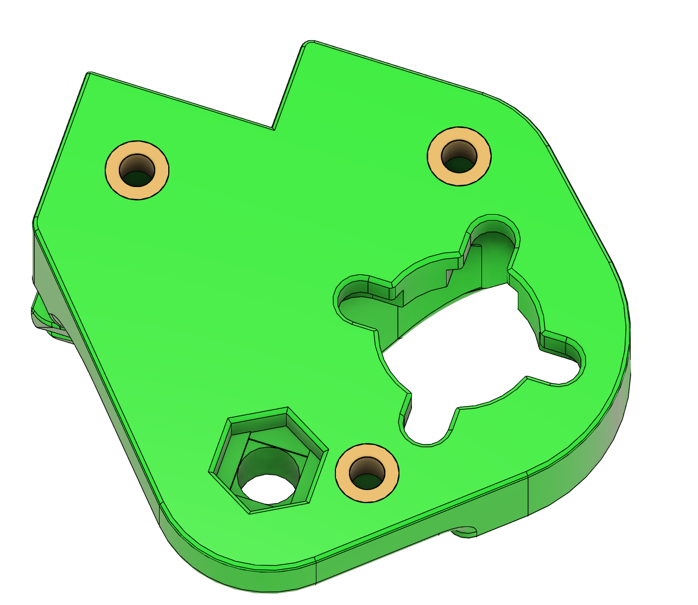
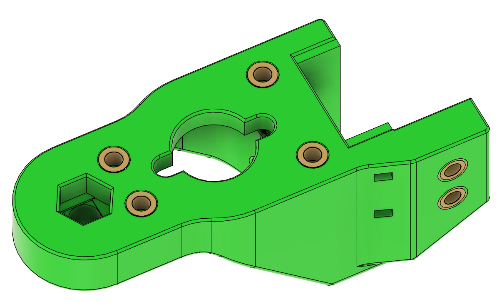

# Install Z steppers

**Parts needed:**
* 12 M3x12 SHCS 
* 12 M3x10 BHCS
* 3 Nema-17-200 steppers
  
**Printed parts:**
* 1 z_motor_mount_left
* 1 z_motor_mount_right
* 1 z_motor_mount_rear

**Steps:**

1. Attach a motor mount to each stepper using M3x12 SHCS screws
2. Attach motors to frame using M3x10 BHCS hooks

# Attach deck panel

**Parts needed:**
* Deck panel 
  
**Printed parts:**
* 8 deck_support_misumi

**Steps:**
1. Flip the frame upside down for this step
2. Lay the deck plate down, it will be supported by the Z steppers
3. Fix it in place by adding 2 of the printed deck supports to each side, positioning is not critical

# Left Z carriage

**Parts needed:**
* 4 M2x6 BHCS
* 3 M3x6 BHCS
* 1 Leadscrew nut
* 2 M3x12 SHCS
* 2 M3 Nylock nuts 
* 3 M3 heatset nuts
  
**Printed parts:**
* 1 z_carriage_left
* 1 [a]_z_carriage_left

**Steps:**
1. Insert 3 M3 heatset nuts into the z_carriage_left part (refer to [Nero3d heatset video](https://www.youtube.com/watch?v=cyof7fYFcuQ&list=PL7zrGeKp_8CTDOmpwZr5JnCSJqEghFh9j&index=31) if you need help with heatsets)
2. Attach the accent piece to the main piece using 3 M3x6 BHCS screws
3. Thread the leadscrew nut onto the left Z stepper shaft
4. Attach the printed parts to the rail carriage using 4 M2x6 BHCS screws
5. Attach the printed parts to the leadscrew nut using 2 M3x12 SCHS screws and the M3 nylock nuts. These should be slightly snug but not tight. There should be enough looseness for the nut to slide slightly in the printed carriage part.

# Right Z carriage

**Parts needed:**
* 4 M2x6 BHCS
* 3 M3x6 BHCS
* 1 Leadscrew nut
* 2 M3x12 SHCS
* 2 M3 Nylock nuts 
* 3 M3 heatset nuts
  
**Printed parts:**
* 1 z_carriage_right
* 1 [a]_z_carriage_right

**Steps:**
1. Insert 3 M3 heatset nuts into the z_carriage_right part
3. Attach the accent piece to the main piece using 3 M3x6 BHCS screws
4. Thread the leadscrew nut onto the right Z stepper shaft
5. Attach the printed parts to the rail carriage using 4 M2x6 BHCS screws
6. Attach the printed parts to the leadscrew nut using 2 M3x12 SCHS screws and the M3 nylock nuts. These should be slightly snug but not tight. There should be enough looseness for the nut to slide slightly in the printed carriage part.

# Rear Z carriage 

**Parts needed:**
* 4 M2x6 BHCS
* 4 M3x6 BHCS
* 1 Leadscrew nut
* 2 M3x12 SHCS
* 2 M3 Nylock nuts 
* 6 M3 heatset nuts
  

**Printed parts:**
* 1 z_carriage_rear
* 1 [a]_z_carriage_rear

**Steps:**
1. Insert 6 M3 heatset nuts into the z_carriage_rear part as shown
3. Attach the accent piece to the main piece using 4 M3x6 BHCS screws
4. Thread the leadscrew nut onto the rear Z stepper shaft
5. Attach the printed parts to the rail carriage using 4 M2x6 BHCS screws
6. Attach the printed parts to the leadscrew nut using 2 M3x12 SCHS screws and the M3 nylock nuts. These should be slightly snug but not tight. There should be enough looseness for the nut to slide slightly in the printed carriage part.

