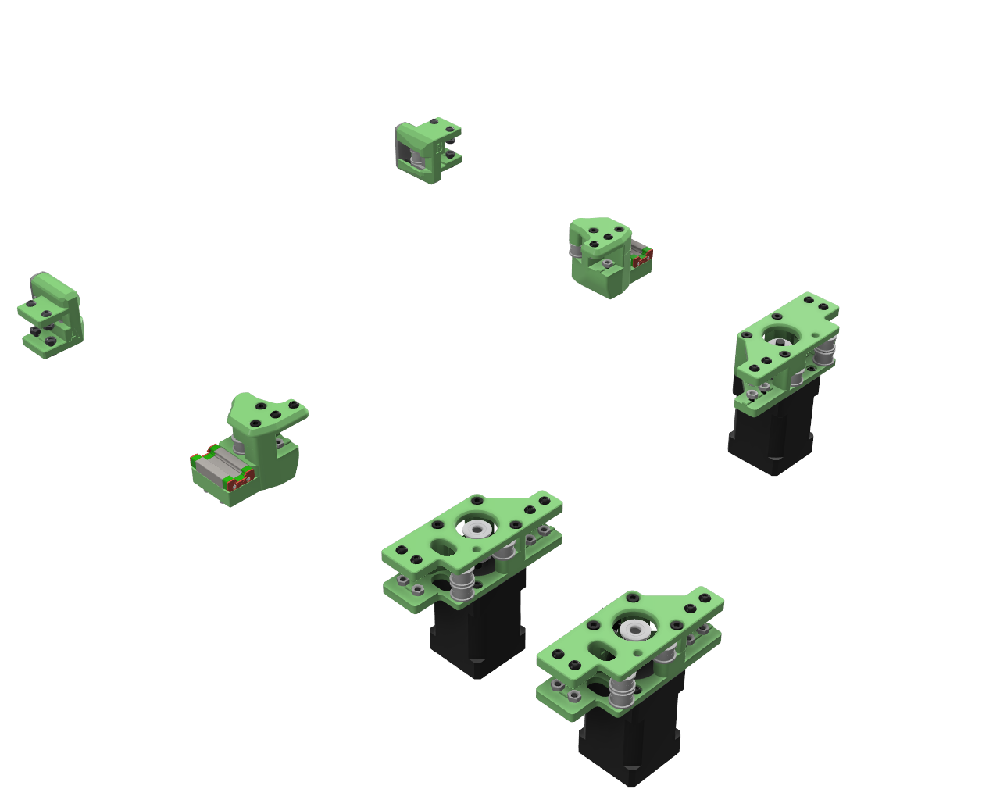
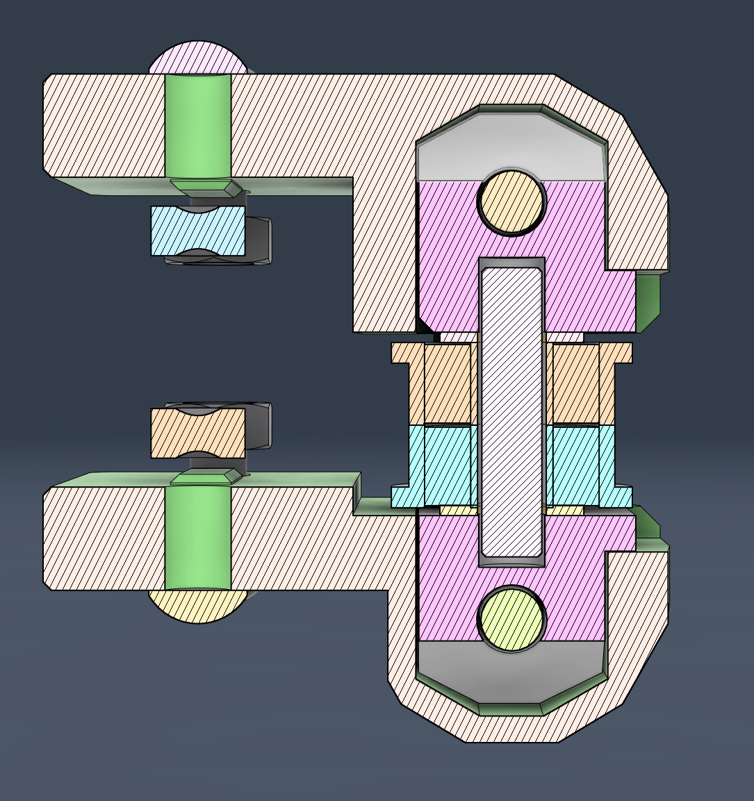
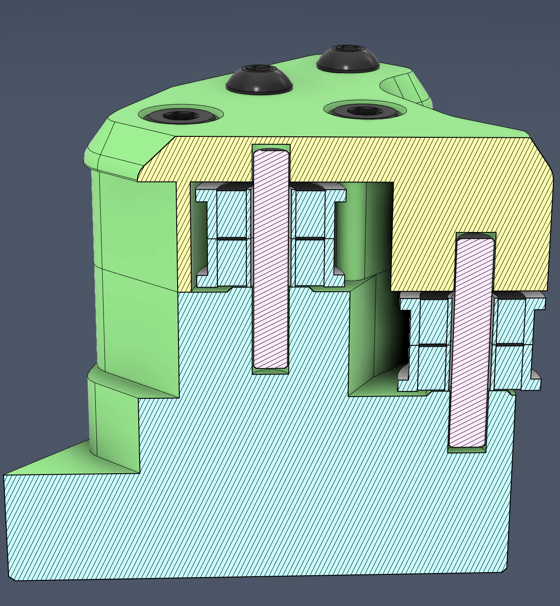
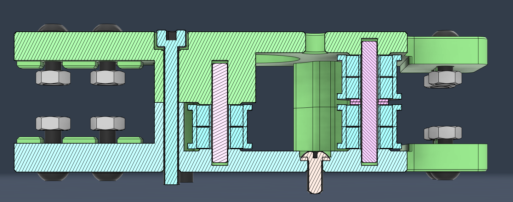

# Salad Fork Captive Pins Mod
A Salad Fork mod to use captive pins instead of screws as the axle for all idlers.
 

The standard design for Voron printers uses M3 screws as the axle for idlers. Because the pins
have a smooth surface and are very close to 3mm in diameter, some people feel they work better
than screws, whose diameter is not exactly 3mm (more like 2.9) and are rough due to the threads.

Captive pins as opposed to regular pins make things a little easier to assemble, eliminate
concerns about pins walking out over time, and provide a cleaner look.

The idea for this mod came from work by Voron Discord user @andre.midnite, who designed the[Salad-Fork-Captive-Pins-Mod](https://github.com/Midnite3DP/Salad-Fork-Captive-Pins-Mod). That work was based in turn on the work of hartk#1213 and speedy#2640. Hartk designed the [Micron Pin Mod](https://github.com/printersforants/Micron/tree/main/Mods/Hartk/Pin_Mod/) and Speedy designed a remix of [Rama Idlers](https://github.com/Ramalama2/Voron-2-Mods/tree/main/Front_Idlers) scaled down for the Salad Fork.

My work in this mod was based on the [Salad_Fork](https://github.com/PrintersForAnts/Salad_Fork) 1.1 design from Voron Discord user yeriwyn. The mod is a very simple change to the printed parts for the Gantry so that the 10 idler screws may be replaceed by 3mm pins. 

## BOM

The pin sizes are:
* (Qty 6) 3x18 mm
* (Qty 2) 3x22 mm
* (Qty 2) 3x14 mm

The 22mm pins are used for the bearing stack on the AB motors, the 14mm pins are used for the tensioners, and the 18mm pins are used for the X/Y joints. Assembly is fairly straightforward, and in fact the slight friction fit of the pins makes things a bit easier than with the screws. 

There several vendors that may still be selling a pins kit for the older Salad Fork 1.0 design ([Example](https://dfh.fm/products/ultra-lightweight-aluminum-salad-fork-pins-mod-kit)). Note, however, that these kits do not have the 14mm pins, so if you get one of these, you will need to cut down two of the 18mm pins.

Alternatively, you can buy 3mm dowel pins in the appropriate lengths from vendors such as McMaster-Carr ([Example](https://www.mcmaster.com/catalog/130/3816/93600A364)). 

## Assembly

All STL have been oriented correctly for printing. The parts are the same regardless of which size printer you are building. Follow the print instructions in the [Salad_Fork](https://github.com/PrintersForAnts/Salad_Fork) README. Note that the Tensioner Cover and Tensioner Housing parts are unmodified, so use the originals from Salad_Fork.

Also note that, just like the unmodified Salad_Fork design, there are distrinct A_Drive_Frame_Upper printed parts for sensorless and limit-switch based approaches to homing. 

## Contact Info

If you need to reach me, I am on the Voron Discord, user name motocoder.